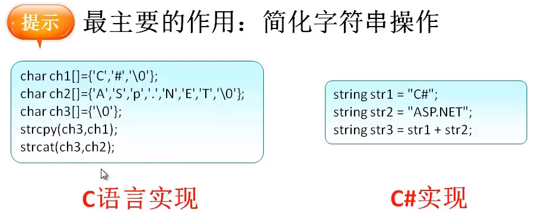
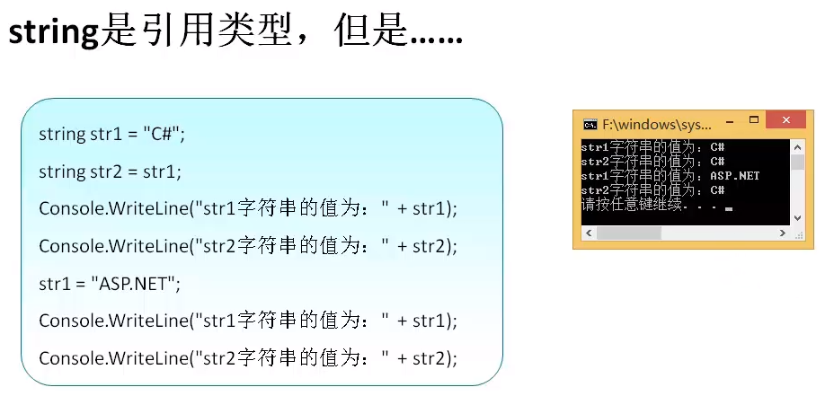

# C# 字符串（String）





在 C# 中，您可以使用字符数组来表示字符串，但是，更常见的做法是使用 **string** 关键字来声明一个字符串变量。string 关键字是 **System.String** 类的别名。

## 1.创建 String 对象

您可以使用以下方法之一来创建 string 对象：

* 通过给 String 变量指定一个字符串
* 通过使用 String 类构造函数
* 通过使用字符串串联运算符（ + ）
* 通过检索属性或调用一个返回字符串的方法
* 通过格式化方法来转换一个值或对象为它的字符串表示形式

下面的实例演示了这点：

```c#
using System;

namespace StringApplication
{
    class Program
    {
        static void Main(string[] args)
        {
           //字符串，字符串连接
            string fname, lname;
            fname = "Rowan";
            lname = "Atkinson";

            string fullname = fname + lname;
            Console.WriteLine("Full Name: {0}", fullname);

            //通过使用 string 构造函数
            char[] letters = { 'H', 'e', 'l', 'l','o' };
            string greetings = new string(letters);
            Console.WriteLine("Greetings: {0}", greetings);

            //方法返回字符串
            string[] sarray = { "Hello", "From", "Tutorials", "Point" };
            string message = String.Join(" ", sarray);
            Console.WriteLine("Message: {0}", message);

            //用于转化值的格式化方法
            DateTime waiting = new DateTime(2012, 10, 10, 17, 58, 1);
            string chat = String.Format("Message sent at {0:t} on {0:D}", 
            waiting);
            Console.WriteLine("Message: {0}", chat);
            Console.ReadKey() ;
        }
    }
}
```

当上面的代码被编译和执行时，它会产生下列结果：

```
Full Name: RowanAtkinson
Greetings: Hello
Message: Hello From Tutorials Point
Message: Message sent at 17:58 on Wednesday, 10 October 2012
```

## 2.String 类的属性

String 类有以下两个属性：

| 序号 | 属性名称 & 描述                                              |
| :--- | :----------------------------------------------------------- |
| 1    | **Chars** 在当前 *String* 对象中获取 *Char* 对象的指定位置。 |
| 2    | **Length** 在当前的 *String* 对象中获取字符数。              |

## 3.String 类的方法

String 类有许多方法用于 string 对象的操作。下面的表格提供了一些最常用的方法：

| 序号 | 方法名称 & 描述                                              |
| :--- | :----------------------------------------------------------- |
| 1    | **public static int Compare( string strA, string strB )**  比较两个指定的 string 对象，并返回一个表示它们在排列顺序中相对位置的整数。该方法区分大小写。 |
| 2    | **public static int Compare( string strA, string strB, bool ignoreCase )**  比较两个指定的 string 对象，并返回一个表示它们在排列顺序中相对位置的整数。但是，如果布尔参数为真时，该方法不区分大小写。 |
| 3    | **public static string Concat( string str0, string str1 )**  连接两个 string 对象。 |
| 4    | **public static string Concat( string str0, string str1, string str2 )**  连接三个 string 对象。 |
| 5    | **public static string Concat( string str0, string str1, string str2, string str3 )**  连接四个 string 对象。 |
| 6    | **public bool Contains( string value )**  返回一个表示指定 string 对象是否出现在字符串中的值。 |
| 7    | **public static string Copy( string str )**  创建一个与指定字符串具有相同值的新的 String 对象。 |
| 8    | **public void CopyTo( int sourceIndex, char[] destination, int destinationIndex, int count )**  从 string 对象的指定位置开始复制指定数量的字符到 Unicode 字符数组中的指定位置。 |
| 9    | **public bool EndsWith( string value )**  判断 string 对象的结尾是否匹配指定的字符串。 |
| 10   | **public bool Equals( string value )**  判断当前的 string 对象是否与指定的 string 对象具有相同的值。 |
| 11   | **public static bool Equals( string a, string b )**  判断两个指定的 string 对象是否具有相同的值。 |
| 12   | **public static string Format( string format, Object arg0 )**  把指定字符串中一个或多个格式项替换为指定对象的字符串表示形式。 |
| 13   | **public int IndexOf( char value )**  返回指定 Unicode 字符在当前字符串中第一次出现的索引，索引从 0 开始。 |
| 14   | **public int IndexOf( string value )**  返回指定字符串在该实例中第一次出现的索引，索引从 0 开始。 |
| 15   | **public int IndexOf( char value, int startIndex )**  返回指定 Unicode 字符从该字符串中指定字符位置开始搜索第一次出现的索引，索引从 0 开始。 |
| 16   | **public int IndexOf( string value, int startIndex )**  返回指定字符串从该实例中指定字符位置开始搜索第一次出现的索引，索引从 0 开始。 |
| 17   | **public int IndexOfAny( char[] anyOf )**  返回某一个指定的 Unicode 字符数组中任意字符在该实例中第一次出现的索引，索引从 0 开始。 |
| 18   | **public int IndexOfAny( char[] anyOf, int startIndex )**  返回某一个指定的 Unicode 字符数组中任意字符从该实例中指定字符位置开始搜索第一次出现的索引，索引从 0 开始。 |
| 19   | **public string Insert( int startIndex, string value )**  返回一个新的字符串，其中，指定的字符串被插入在当前 string 对象的指定索引位置。 |
| 20   | **public static bool IsNullOrEmpty( string value )**  指示指定的字符串是否为 null 或者是否为一个空的字符串。 |
| 21   | **public static string Join( string separator, string[] value )**  连接一个字符串数组中的所有元素，使用指定的分隔符分隔每个元素。 |
| 22   | **public static string Join( string separator, string[] value, int startIndex, int count )**  连接接一个字符串数组中的指定位置开始的指定元素，使用指定的分隔符分隔每个元素。 |
| 23   | **public int LastIndexOf( char value )**  返回指定 Unicode 字符在当前 string 对象中最后一次出现的索引位置，索引从 0 开始。 |
| 24   | **public int LastIndexOf( string value )**  返回指定字符串在当前 string 对象中最后一次出现的索引位置，索引从 0 开始。 |
| 25   | **public string Remove( int startIndex )**  移除当前实例中的所有字符，从指定位置开始，一直到最后一个位置为止，并返回字符串。 |
| 26   | **public string Remove( int startIndex, int count )**  从当前字符串的指定位置开始移除指定数量的字符，并返回字符串。 |
| 27   | **public string Replace( char oldChar, char newChar )**  把当前 string 对象中，所有指定的 Unicode 字符替换为另一个指定的 Unicode 字符，并返回新的字符串。 |
| 28   | **public string Replace( string oldValue, string newValue )**  把当前 string 对象中，所有指定的字符串替换为另一个指定的字符串，并返回新的字符串。 |
| 29   | **public string[] Split( params char[] separator )**  返回一个字符串数组，包含当前的 string 对象中的子字符串，子字符串是使用指定的 Unicode 字符数组中的元素进行分隔的。 |
| 30   | **public string[] Split( char[] separator, int count )**  返回一个字符串数组，包含当前的 string 对象中的子字符串，子字符串是使用指定的 Unicode 字符数组中的元素进行分隔的。int 参数指定要返回的子字符串的最大数目。 |
| 31   | **public bool StartsWith( string value )**  判断字符串实例的开头是否匹配指定的字符串。 |
| 32   | **public char[] ToCharArray()** 返回一个带有当前 string 对象中所有字符的 Unicode 字符数组。 |
| 33   | **public char[] ToCharArray( int startIndex, int length )**  返回一个带有当前 string 对象中所有字符的 Unicode 字符数组，从指定的索引开始，直到指定的长度为止。 |
| 34   | **public string ToLower()** 把字符串转换为小写并返回。       |
| 35   | **public string ToUpper()** 把字符串转换为大写并返回。       |
| 36   | **public string Trim()** 移除当前 String 对象中的所有前导空白字符和后置空白字符。 |

上面的方法列表并不详尽，请访问 MSDN 库，查看完整的方法列表和 String 类构造函数。

## 4.实例

下面的实例演示了上面提到的一些方法：

### 4.1比较字符串 `Compare` 

```c#
using System;

namespace StringApplication
{
   class StringProg
   {
      static void Main(string[] args)
      {
         string str1 = "This is test";
         string str2 = "This is text";

         if (String.Compare(str1, str2) == 0)
         {
            Console.WriteLine(str1 + " and " + str2 +  " are equal.");
         }
         else
         {
            Console.WriteLine(str1 + " and " + str2 + " are not equal.");
         }
         Console.ReadKey() ;
      }
   }
}
```

当上面的代码被编译和执行时，它会产生下列结果：

```cmd
This is test and This is text are not equal.
```

### 4.2字符串包含字符串`Contains` 

```c#
using System;

namespace StringApplication
{
   class StringProg
   {
      static void Main(string[] args)
      {
         string str = "This is test";
         if (str.Contains("test"))
         {
            Console.WriteLine("The sequence 'test' was found.");
         }
         Console.ReadKey() ;
      }
   }
}
```

当上面的代码被编译和执行时，它会产生下列结果：

```cmd
The sequence 'test' was found.
```

### 4.3获取子字符串`Substring`

```c#
using System; 
namespace StringApplication 
{
        class StringProg 
        { 
                static void Main(string[] args) 
                { 
                        string str = "Last night I dreamt of San Pedro"; 
                        Console.WriteLine(str); 
                        string substr = str.Substring(23); 
                        Console.WriteLine(substr); 
                        Console.ReadKey() ; 
                } 
        } 
}
```

当上面的代码被编译和执行时，它会产生下列结果：

```
Last night I dreamt of San Pedro
San Pedro
```

### 4.4连接字符串`Join`

```c#
using System;

namespace StringApplication
{
   class StringProg
   {
      static void Main(string[] args)
      {
         string[] starray = new string[]{"Down the way nights are dark",
         "And the sun shines daily on the mountain top",
         "I took a trip on a sailing ship",
         "And when I reached Jamaica",
         "I made a stop"};

         string str = String.Join("\n", starray);
         Console.WriteLine(str);
         Console.ReadKey() ;
      }
   }
}
```

当上面的代码被编译和执行时，它会产生下列结果：

```
Down the way nights are dark
And the sun shines daily on the mountain top
I took a trip on a sailing ship
And when I reached Jamaica
I made a stop
```

## 5.格式化

### 5.1标准数值格式化规范

| 符号     | 名称     | 示例                           |
| -------- | -------- | ------------------------------ |
| `C`或`c` | 货币     | `￥123`或`-￥1232.456`         |
| `D`或`d` | Decimal  | `1234`或`-00123245`            |
| `E`或`e` | 指数     | `1.234E+003`或`-1.231232e+003` |
| `F`或`f` | 定点     | `12324.57`或`-12324.5600`      |
| `N`或`n` | Number   | `1,234.57`或`-1,234.570`       |
| `P`或`p` | 百分比   | `100.00%`或`100%`              |
| `X`或`x` | 十六进制 | `FF`或`00ff`                   |

* 示例

```c#
Console.WriteLine("金额显示{0:c}", 368);
Console.WriteLine("科学计数法{0:e}", 1232368);
Console.WriteLine("分割数字{0:n}", 368);
Console.WriteLine("π保留两位小数{0:f2}", Math.PI);
Console.WriteLine("十六进制{0:x4}", 368);
Console.WriteLine("百分比{0:p}", 0.87);
```

* 结果

```cmd
金额显示￥368.00
科学计数法1.232368e+006
分割数字368.00
π保留两位小数3.14
十六进制0170
百分比87.00%
```

### 5.2日期格式化规范

| 符号     | 说明                  | 举例                      |
| -------- | --------------------- | ------------------------- |
| `d`      | 短日期格式            | `YYYY-MM-dd`              |
| `D`      | 长日期格式            | `YYYY年MM月dd日`          |
| `f`      | 完整日期/时间格式(短) | `YYYY年MM月dd日 hh:mm`    |
| `F`      | 完整日期/时间格式(长) | `YYYY年MM月dd日 hh:mm:ss` |
| `g`      | 常规日期/时间格式(短) | `YYYY-MM-dd hh:mm`        |
| `G`      | 常规日期/时间格式(长) | `YYYY-MM-dd hh:mm:ss`     |
| `M`或`m` | 月/日格式             | `MM月dd日`                |
| `t`      | 短时间格式            | `hh:mm`                   |
| `T`      | 长时间格式            | `hh:mm:ss`                |
| `Y`或`y` | 年/月格式             | `YYYY年MM月`              |

* 实例

```c#
DateTime date = DateTime.Now;
Console.WriteLine("短日期时间{0:d}", date);
Console.WriteLine("长时间日期{0:D}", date);
Console.WriteLine("完整日期/时间格式(短){0:f}", date);
Console.WriteLine("完整日期/时间格式(长){0:F}", date);
Console.WriteLine("常规日期/时间格式(短){0:g}", date);
Console.WriteLine("常规日期/时间格式(长){0:G}", date);
Console.WriteLine("月/日格式{0:M}", date);
Console.WriteLine("短时间格式{0:t}", date);
Console.WriteLine("长时间格式{0:T}", date);
Console.WriteLine("年/月格式{0:y}", date);
Console.ReadKey();
```

* 结果

```cmd
短日期时间2019/6/8
长时间日期2019年6月8日
完整日期/时间格式(短)2019年6月8日 7:58
完整日期/时间格式(长)2019年6月8日 7:58:09
常规日期/时间格式(短)2019/6/8 7:58
常规日期/时间格式(长)2019/6/8 7:58:09
月/日格式6月8日
短时间格式7:58
长时间格式7:58:09
年/月格式2019年6月
```

