# WinForm 界面设计

WinForm 是 Windows Form 的简称，是基于 .NET Framework 平台的客户端（PC软件）开发技术，一般使用 [C#](http://c.biancheng.net/csharp/) 编程。C# WinForm 编程需要创建「Windows窗体应用程序」项目。

NET 提供了大量 Windows 风格的控件和事件，我们可以直接拿来使用，上手简单，开发快速。

Windows 窗体应用程序是 C# 语言中的一个重要应用，也是 C# 语言最常见的应用。这套 C# WinForm 教程将教会大家如何使用 WinForm 进行界面设计，并绑定对应的事件，开发出一个实用的客户端。

对于每一个使用过 Windows 操作系统的读者来说，Windows 应用程序是不会陌生的。使用 C# 语言编写的 Windows 应用程序与 Windows 操作系统的界面类似，每个界面都是由窗体构成的，并且能通过鼠标单击、键盘输入等操作完成相应的功能。

## 1.创建Windows窗体应用程序

创建 Windows 窗体应用程序的步骤与创建控制台应用程序的步骤类似，在 Visual Studio 2019 软件中，依次选择“文件”→“新建”→“项目”命令，弹出如下图所示的对话框。

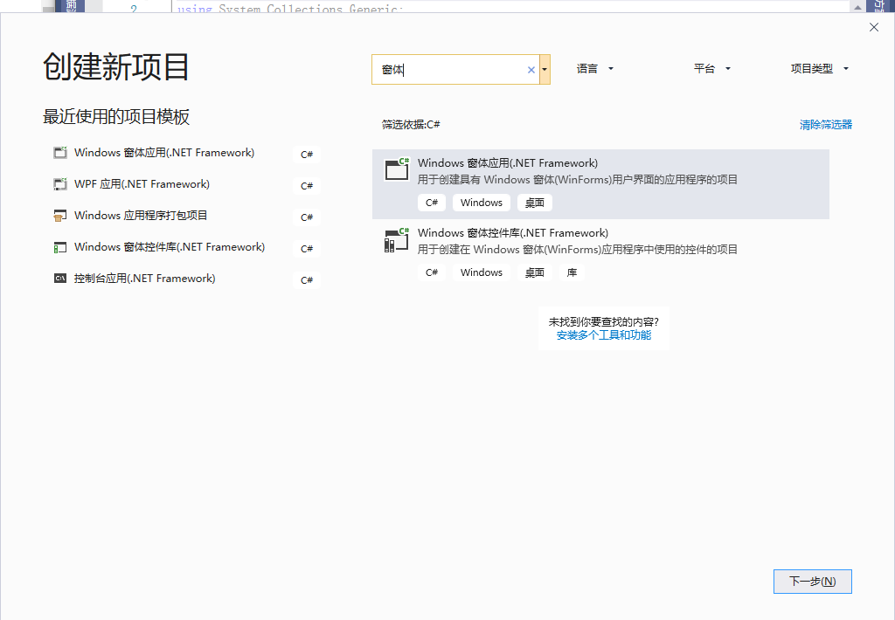

在该对话框中选择“Windows 窗体应用程序”，并更改项目名称、项目位置、解决方案名称等信息，单击“确定”按钮，即可完成 Windows 窗体应用程序的创建，如下图所示。

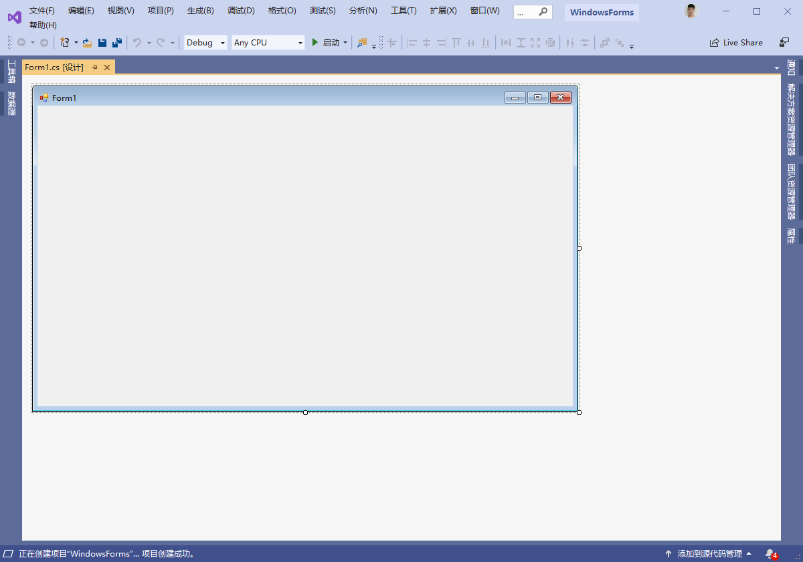

```c#
using System;
using System.Collections.Generic;
using System.Linq;
using System.Threading.Tasks;
using System.Windows.Forms;

namespace WindowsForms
{
    static class Program
    {
        /// <summary>
        /// 应用程序的主入口点。
        /// </summary>
        [STAThread]
        static void Main()
        {
            Application.EnableVisualStyles(); // 1#
            Application.SetCompatibleTextRenderingDefault(false); // 2#
            Application.Run(new Form1()); // 3#
        }
    }
}
```

在上述的代码中

* `1#` 用于启动应用程序中可视的样式, 如果控件和操作系统支持, 那么控件回执就能根据不同的风格进行实现.
* `2#` 控件支持`UseCompatibleTextRenderingproperty`属性, 该方法将此属性设置为默认值.
* `3#` 用于设置在当前项目中要启动的窗体, 这里 `new Form1()`即为要启动的窗体.

在Windows窗体应用程序中界面是由不同类型的控件构成的.

系统中默认的控件全部存放到工具箱中，选择“视图”→“工具箱”，如下图所示。

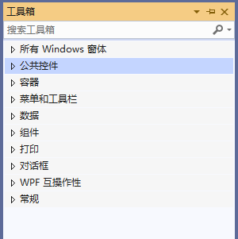

在工具箱中将控件划分为公共控件、容器、菜单和工具栏、数据、组件、打印、对话框等组。

如果工具箱中的控件不能满足开发项目的需求，也可以向工具箱中添加新的控件, 或者对工具箱中的控件重置或进行分组等操作，这都可以通过右击工具箱，在弹出的右键菜单中选择相应的命令实现。

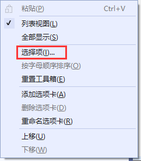

在右键菜单中选择“选择项”命令，弹出如下图所示的对话框。

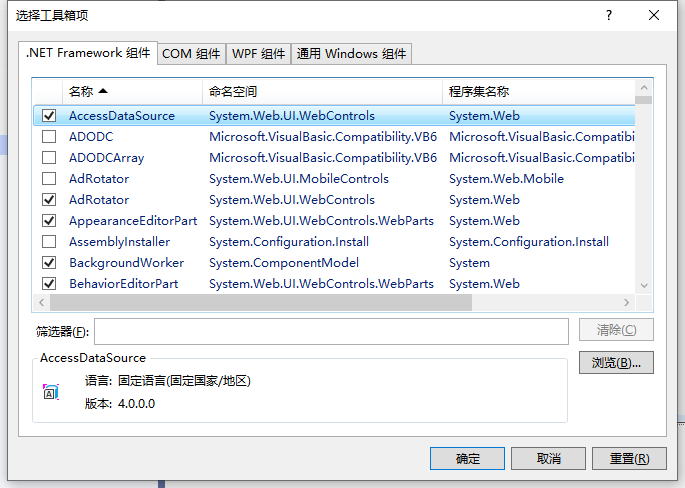

  在该对话框中列出了不同组件中所带的控件，如果需要在工具箱中添加，直接选中相应组件名称前的复选框即可。

如果需要添加外部的控件，则单击“浏览”按钮，找到相应控件的 .dll 或 .exe 程序添加即可。

Windows 窗体应用程序也称为事件驱动程序，也就是通过鼠标单击界面上的控件、通过键盘输入操作控件等操作来触发控件的不同事件完成相应的操作。

例如单击按钮、右击界面、向文本框中输入内容等操作。  

## 2.窗体属性

每一个 Windows 窗体应用程序都是由若干个窗体构成的，窗体中的属性主要用于设置窗体的外观。

在 Windows 窗体应用程序中右击窗体，在弹出的右键菜单中 选择“属性”命令，弹出如下图所示的属性面板。

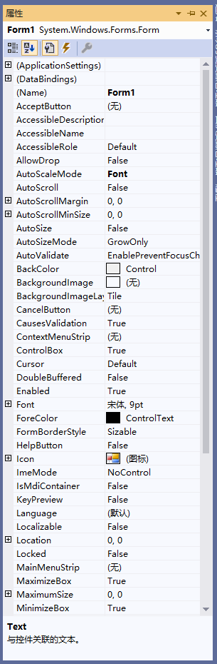

  在该图中列出的属性分为布局、窗口样式等方面，合理地设置好窗体的属性对窗体的 展现效果会起到事半功倍的作用。

窗体的常用属性如下表所示。  

| 属性                  | 作用                                                         |
| --------------------- | ------------------------------------------------------------ |
| Name                  | 用来获取或设置窗体的名称                                     |
| WindowState           | 获取或设置窗体的窗口状态，取值有3种，即Normal（正常）、Minimized（最小化）、Maximized（最大化），默认为 Normal，即正常显示 |
| StartPosition         | 获取或设置窗体运行时的起始位置，取值有 5 种，即 Manual（窗体位置由 Location 属性决定）、CenterScreen（屏幕居中）、WindowsDefaultLocation（ Windows 默认位置）、WindowsDefaultBounds（Windows 默认位置，边界由 Windows 决定）、CenterParent（在父窗体中居中），默认为 WindowsDefaultLocation |
| Text                  | 获取或设置窗口标题栏中的文字                                 |
| MaximizeBox           | 获取或设置窗体标题栏右上角是否有最大化按钮，默认为 True      |
| MinimizeBox           | 获取或设置窗体标题栏右上角是否有最小化按钮，默认为 True      |
| BackColor             | 获取或设置窗体的背景色                                       |
| BackgroundImage       | 获取或设置窗体的背景图像                                     |
| BackgroundImageLayout | 获取或设置图像布局，取值有 5 种，即 None（图片居左显示）、Tile（图像重复，默认值）、Stretch（拉伸）、Center（居中）、Zoom（按比例放大到合适大小） |
| Enabled               | 获取或设置窗体是否可用                                       |
| Font                  | 获取或设置窗体上文字的字体                                   |
| ForeColor             | 获取或设置窗体上文字的颜色                                   |
| Icon                  | 获取或设置窗体上显示的图标                                   |

下面通过实例来演示窗体属性的应用。

【实例】创建一个名为 TestForm 的窗体，并完成如下设置。

* 窗体的标题栏中显示“第一个窗体”。
* 窗体中起始位置居中。
* 窗体中设置一个背景图片。
* 窗体中不显示最大化和最小化按钮。

实现题目中要求的窗体，具体步骤如下。

#### 1) 创建名为 TestForm 的窗体

创建一个 Windows 应用程序 Windows-2，然后右击该项目，在弹出的右键菜单中选择“添加新项”命令，弹出如下图所示。

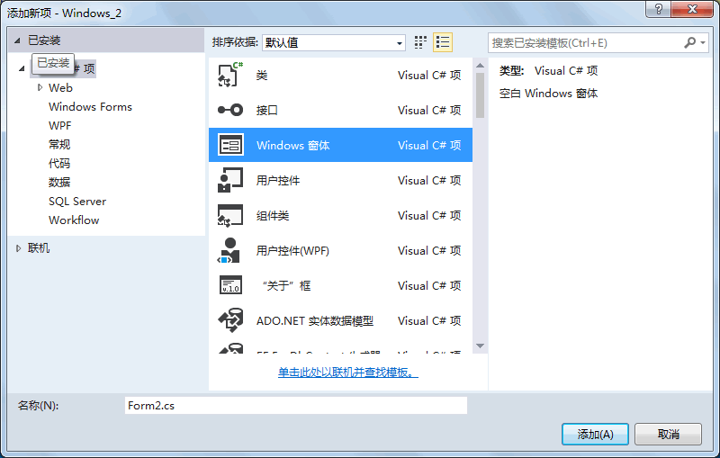

#### 2) 设置 TestForm 窗体的属性

TestForm 窗体的属性设置如下表所示。

| 属性                  | 属性值       |
| --------------------- | ------------ |
| Name                  | TestForm     |
| StartPosition         | CenterScreen |
| Text                  | 第一个窗体   |
| MaximizeBox           | False        |
| MinimizeBox           | False        |
| Backgroundimage       | window_2.jpg |
| BackgroundlmageLayout | Stretch      |

在上述属性中除了背景图片 (Backgroundimage) 属性以外，其他属性直接添加上表中对应的属性值即可。

设置背景图片属性 (Backgroimdlmage) 的方法是单击 Backgroundimage 属性后的按钮，在弹出的对话框中单击“导入”按钮。

如下图所示， 选择图片 window_2.jpg 所在的路径，单击“确定”按钮即可完成背景图片属性的设置。

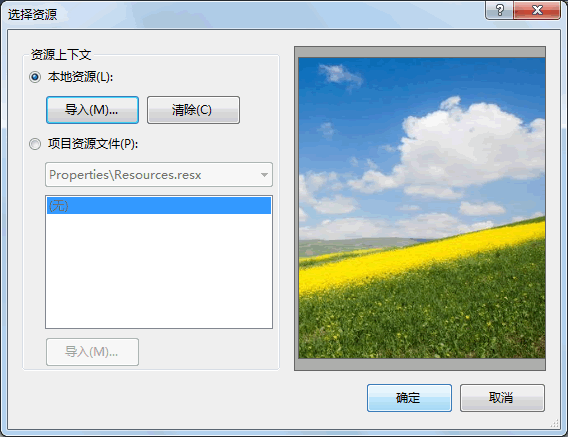

#### 3) 设置 TestForm 窗体为启动窗体

每一个 Windows 窗体应用程序在运行时仅能指定一个启动窗体，设置启动窗体的方式是在项目的 Program.cs 文件中指定。具体的代码如下。

```C#
static class Program
{
    /// <summary>
    /// 应用程序的主入口点。
    /// </summary>
    [STAThread]
    static void Main()
    {
        Application.EnableVisualStyles();
        Application.SetCompatibleTextRenderingDefault(false);
        Application.Run(new TestForm());    //设置启动窗体
    }
}
```

完成以上 3 步后按 F5 键运行程序，效果如下图所示。

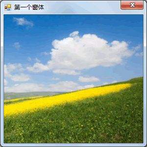

## 3.窗体事件

在窗体中除了可以通过设置属性改变外观外，还提供了事件来方便窗体的操作。

在打开操作系统后，单击鼠标或者敲击键盘都可以在操作系统中完成不同的任务，例如双击鼠标打开“我的电脑”、在桌面上右击会出现右键菜单、单击一个文件夹后按 F2 键可以更改文件夹的名称等。

实际上这些操作都是 Windows 操作系统中的事件。

在 Windows 窗体应用程序中系统已经自定义了一些事件，在窗体属性面板中单击闪电图标即可查看到窗体中的事件，如下图所示。

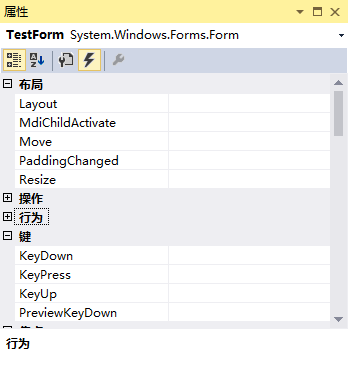

窗体中常用的事件如下表所示。

| 事件             | 作用                                     |
| ---------------- | ---------------------------------------- |
| Load             | 窗体加载事件，在运行窗体时即可执行该事件 |
| MouseClick       | 鼠标单击事件                             |
| MouseDoubleClick | 鼠标双击事件                             |
| MouseMove        | 鼠标移动事件                             |
| KeyDown          | 键盘按下事件                             |
| KeyUp            | 键盘释放事件                             |
| FormClosing      | 窗体关闭事件，关闭窗体时发生             |
| FormClosed       | 窗体关闭事件，关闭窗体后发生             |

下面通过实例来演示窗体中事件的应用。

【实例】通过窗体的不同事件改变窗体的背景颜色。

在本例中采用的事件分别是窗体加载事件 (Load)、鼠标单击事件 (MouseClick)、鼠标双击事件 (MouseDoubleClick)。

实现该操作的步骤如下。

### 1) 新建窗体

在上一节《C#窗体属性》中使用的 Windows-2 项目中添加一个名为 ColorForm 的窗体。

### 2) 添加事件

右击该窗体，在弹出的右键菜单中选择“属性”命令，然后在弹出的面板中单击闪电图标进入窗体事件设置界面。

在该界面中依次选中需要创建的事件，并双击该事件右侧的单元格，系统会自动为其生成对应事件的处理方法，设置后的属性面板如下图所示。

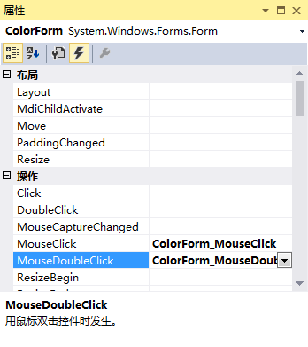

设置好事件后会在 ColorForm 窗体对应的代码文件中自动生成与事件对应的 4 个方法, 代码如下。

```c#
public partial class ColorForm : Form
{
    public ColorForm()
    {
        InitializeComponent();
    }
    private void ColorForm_MouseClick(object sender, MouseEventArgs e)
    {
    }
    private void ColorForm_MouseDoubleClick(object sender, MouseEventArgs e)
    {
    }
    private void ColorForm_Load(object sender, EventArgs e)
    {
    }
}
```

在执行不同事件时，系统会自动执行事件所对应方法中的内容。

### 3) 添加事件处理代码

在本例中每个事件完成的操作都是更改窗体的背景颜色，窗体的背景颜色所对应的属性是 BackColor。

除了可以在属性面板中设置外，使用代码设置的方式是使用 this 关键字代表当前窗体的实例，BackColor 属性类型是 Color 枚举类型的，代码如下。

```
this.BackColor = Color.Red;
```

上面的代码是将窗体的背景颜色设置为红色。

下面分别将类似代码添加到每一个事件中，代码如下。

```c#
using System;
using System.Collections.Generic;
using System.ComponentModel;
using System.Data;
using System.Drawing;
using System.Linq;
using System.Text;
using System.Threading.Tasks;
using System.Windows.Forms;

namespace WindowsForms
{
    public partial class Name : Form
    {
        public Name()
        {
            InitializeComponent();
        }

        private void onClick(object sender, MouseEventArgs e)
        {
            this.BackColor = Color.Blue;
        }

        private void onDoubleClick(object sender, MouseEventArgs e)
        {
            this.BackColor = Color.AliceBlue;
        }

        private void Form_Load(object sender, EventArgs e)
        {
            this.BackColor = Color.Chocolate;
        }
    }
}

```

### 4) 设置启动窗体

在 Windows-2 项目的 Program.cs 类中将 ColorForm 窗体设置为启动窗体，代码如下。

```c#
static class Program
{
    /// <summary>
    /// 应用程序的主入口点。
    /// </summary>
    [STAThread]
    static void Main()
    {
        Application.EnableVisualStyles();
        Application.SetCompatibleTextRenderingDefault(false);
        Application.Run(new ColorForm());    //设置启动窗体
    }
}
```

执行上面的代码，效果如下图所示。

* 加载完成

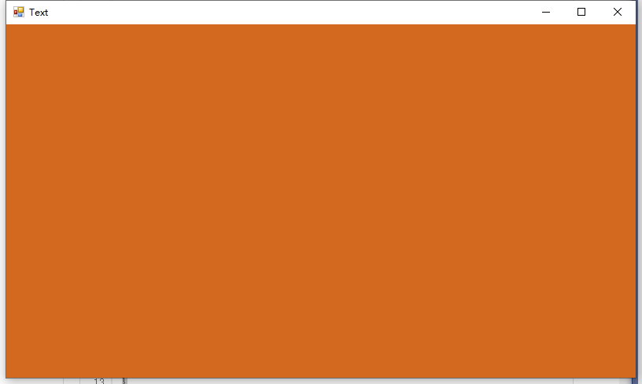

* 单击窗口

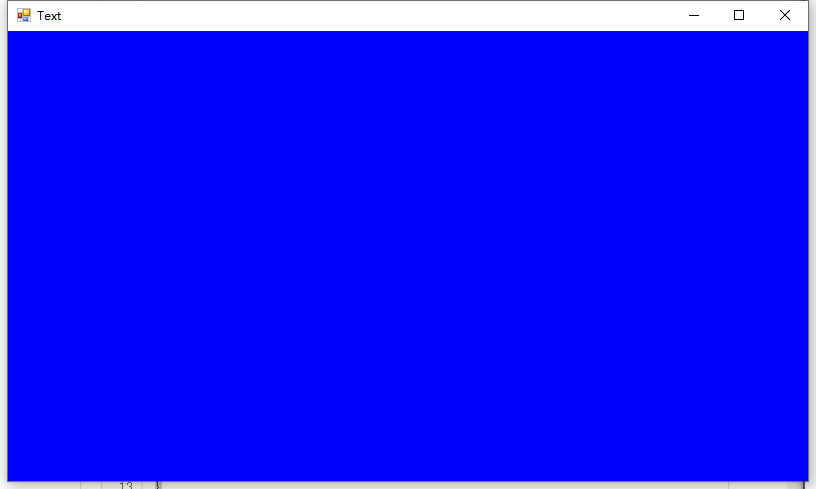

* 双击窗口

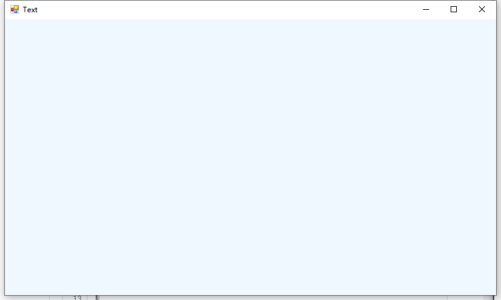


## 4.窗体方法

自定义的窗体都继承自 System.Windows.Form 类，能使用 Form 类中已有的成员，包括属性、方法、事件等。

在前面《C#窗体属性》和《C#窗体事件》中已经分别介绍了窗体中常用的属性和事件。

实际上窗体中也有一些从 System.Windows.Form 类继承的方法，如下表所示。

| 方法                      | 作用                     |
| ------------------------- | ------------------------ |
| void Show()               | 显示窗体                 |
| void Hide()               | 隐藏窗体                 |
| DialogResult ShowDialog() | 以对话框模式显示窗体     |
| void CenterToParent()     | 使窗体在父窗体边界内居中 |
| void CenterToScreen()     | 使窗体在当前屏幕上居中   |
| void Activate()           | 激活窗体并给予它焦点     |
| void Close()              | 关闭窗体                 |

下面通过实例来演示窗体中方法的应用。

【实例】在 MainForm 窗体中单击，弹出一个新窗体 NewForm；在新窗体中单击，将 NewForm 窗体居中，双击，关闭 NewForm 窗体。

实现题目要求的效果需要经过以下步骤：

### 1) 在项目中添加所需的窗体

在 Windows-2 项目中添加所需的 MainForm 窗体和 NewForm 窗体。

### 2) 设置 MainForm 窗体中事件

在 MainForm 窗体中添加鼠标单击窗体事件，并在该事件对应的方法中写入打开 NewForm 窗体的代码，具体代码如下。

```c#
using System;
using System.Collections.Generic;
using System.ComponentModel;
using System.Data;
using System.Drawing;
using System.Linq;
using System.Text;
using System.Threading.Tasks;
using System.Windows.Forms;

namespace WindowsForms
{
    public partial class MainForm : Form
    {
        public MainForm()
        {
            InitializeComponent();
        }

        private void onClick(object sender, MouseEventArgs e)
        {
            this.BackColor = Color.Blue;
        }

        private void onDoubleClick(object sender, MouseEventArgs e)
        {
            this.BackColor = Color.AliceBlue;
        }

        private void Form_Load(object sender, EventArgs e)
        {
            this.BackColor = Color.Chocolate;
        }

        private void Button1_Click(object sender, EventArgs e)
        {
            // 创建窗体
            Form cform = new ClickForm();
            // 显示窗体
            cform.Show();
        }
    }
}
```

### 3) 设置 NewForm 窗体的事件

在 NewForm 窗体中添加鼠标单击事件将窗体的显示位置居中，添加鼠标双击事件关闭 NewForm 窗体，并在相应的事件中添加代码，具体代码如下。

```c#
using System;
using System.Collections.Generic;
using System.ComponentModel;
using System.Data;
using System.Drawing;
using System.Linq;
using System.Text;
using System.Threading.Tasks;
using System.Windows.Forms;

namespace WindowsForms
{
    public partial class ClickForm : Form
    {
        public ClickForm()
        {
            InitializeComponent();
        }
		// 双击事件
        private void Close(object sender, MouseEventArgs e)
        {
            // 关闭窗口
            this.Close();
        }
		// 单击事件
        private void CenterWin(object sender, MouseEventArgs e)
        {
            // 窗口居中 在 屏幕
            this.CenterToScreen();
        }
    }
}
```

### 4) 将 MainForm 窗体设置为启动窗体

在 Windows-2 项目的 Program.cs 文件中设置 MainForm 窗体为启动窗体，代码如下。

```c#
using System;
using System.Collections.Generic;
using System.Linq;
using System.Threading.Tasks;
using System.Windows.Forms;

namespace WindowsForms
{
    static class Program
    {
        /// <summary>
        /// 应用程序的主入口点。
        /// </summary>
        [STAThread]
        static void Main()
        {
            Application.EnableVisualStyles();
            Application.SetCompatibleTextRenderingDefault(false);
            Application.Run(new MainForm());
        }
    }
}

```

完成以上步骤后运行该项目，并在 MainForm 窗体上单击鼠标，效果如下图所示。

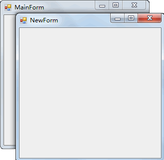

单击 NewForm 窗体后，NewForm 窗体显示在屏幕中央，双击 NewForm 窗体即可将该窗体关闭。

在使用窗体中的方法时需要注意，如果是当前窗体需要调用方法直接使用 `this` 关键字代表当前窗体，通过`this.方法名` (参数列表)的方式调用即可。

如果要操作其他窗体，则需要用窗体的实例来调用方法。

## 5.McssageBox 消息框

消息框在 Windows 操作系统经常用到，例如在将某个文件或文件夹移动到回收站中时系统会自动弹出如下图所示的消息框。

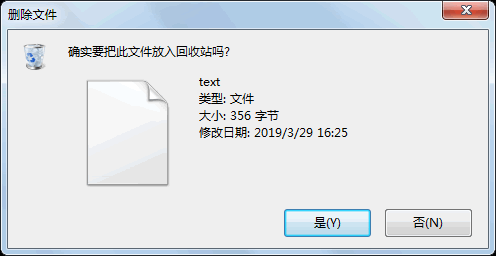

在 Windows 窗体应用程序中向用户提示操作时也是采用消息框弹出的形式。

消息框是通过 McssageBox 类来实现的，在 MessageBox 类中仅定义了 Show 的多个重载方法，该方法的作用就是弹出一个消息框。

由于 Show 方法是一个静态的方法，因此调用该方法只需要使用

```c#
MessageBox.Show( 参数 )
```

的形式即可弹出消息框。

消息框在显示时有不同的样式， 例如标题、图标、按钮等。

常用的 Show 方法参数如下表所示。

| 方法                                                         | 说明                                                         |
| ------------------------------------------------------------ | ------------------------------------------------------------ |
| DialogResult Show(string text)                               | 指定消息框中显示的文本（text）                               |
| DialogResult Show(string text, string caption)               | 指定消息框中显示的文本（text）以及消息框的标题（caption）    |
| DialogResult Show(string text, string caption,  MessageBoxButtons buttons) | 指定消息框中显示的文本（text）、消息框的 标题（caption）以及消息框中显示的按钮 （buttons） |
| DialogResult Show(string text, string caption, MessageBoxButtons buttons, MessageBoxIcon icon) | 指定消息框中显示的文本（text）、消息框的 标题（caption ）、消息框中显示的按钮 （buttons）以及消息框中显示的图标（icon） |

在上面所列出方法的参数中还涉及两个枚举类型，一个是 MessageBoxButtons，一个是 MessageBoxIcon。下面分别介绍这两个枚举类型中的具体值。

MessageBoxButtons 枚举类型主要用于设置消息框中显示的按钮，具体的枚举值如下。

* OK：在消息框中显示“确定”按钮。
* OKCancel：在消息框中显示“确定”和“取消”按钮。
* AbortRetryIgnore：在消息框中显示“中止” “重试”和“忽略”按钮。
* YesNoCancel：在消息框中显示“是” “否”和“取消”按钮。
* YesNo：在消息框中显示“是”和“否”按钮。
* RetryCancel：在消息框中显示“重试”和“取消”按钮。

MessageBoxIcon 枚举类型主要用于设置消息框中显示的图标，具体的枚举值如下。

* None：在消息框中不显示任何图标。
* Hand、Stop、Error：在消息框中显示由一个红色背景的圆圈及其中的白色X组成 的图标。
* Question：在消息框中显示由圆圈和其中的一个问号组成的图标。
* Exclamation、Warning：在消息框中显示由一个黄色背景的三角形及其中的一个感叹号组成的图标。
* Asterisk、Information：在消息框中显示由一个圆圈及其中的小写字母 i 组成的图标。

调用 MessageBox 类中的 Show 方法将返回一个 DialogResult 类型的值。

DialogResult 也是一个枚举类型，是消息框的返回值，通过单击消息框中不同的按钮得到不同的消息框返回值。

DialogResult 枚举类型的具体值如下。

* None：消息框没有返回值，表明有消息框继续运行。
* OK：消息框的返回值是 0K （通常从标签为“确定”的按钮发送）。
* Cancel：消息框的返回值是 Cancel （通常从标签为“取消”的按钮发送）。
* Abort：消息框的返回值是 Abort （通常从标签为“中止”的按钮发送）。
* Retry：消息框的返回值是 Retry （通常从标签为“重试”的按钮发送）。
* Ignore：消息框的返回值是 Ignore （通常从标签为“忽略“的按钮发送）。
* Yes：消息框的返回值是 Yes （通常从标签为“是“的按钮发送）。
* No：消息框的返回值是 No （通常从标签为“否“的按钮发送）。

下面通过实例来演示消息框的应用。

【实例】创建一个窗体，单击该窗体弹出一个消息框提示“是否打开新窗口”，如果单击“是”按钮，则打开新窗口，如果单击“否”按钮，则关闭当前窗体。

根据题目要求，完成该实例需要如下步骤。

### 1) 创建所需的窗体

创建一个名为 Windows_3 的项目，并在该项目中添加两个窗体，分别命名为 MainForm、 MessageForm。

### 2) 在 MainForm 窗体中添加事件

在 MainForm 窗体中添加鼠标单击事件，并在相应的事件中添加如下代码。

```c#
public partial class MainForm : Form
{
    public MainForm()
    {
        InitializeComponent();
    }
    private void MainForm_MouseClick(object sender, MouseEventArgs e)
    {
        //弹出消息框，并获取消息框的返回值
        DialogResult dr = MessageBox.Show("是否打开新窗体？", "提示", MessageBoxButtons.YesNo, MessageBoxIcon.Warning);
        //如果消息框返回值是Yes，显示新窗体
        if (dr == DialogResult.Yes)
        {
            MessageForm messageForm = new MessageForm();
            messageForm.Show();
        }
        //如果消息框返回值是No，关闭当前窗体
        else if (dr == DialogResult.No)
        {
            //关闭当前窗体
            this.Close();
        }
    }
}
```

### 3) 设置项目的启动窗体

在 Program.cs 文件中将 MainForm 设置为启动窗体，代码如下。

```c#
static class Program
{
    /// <summary>
    /// 应用程序的主入口点。
    /// </summary>
    [STAThread]
    static void Main()
    {
        Application.EnableVisualStyles();
        Application.SetCompatibleTextRenderingDefault(false);
        Application.Run(new MainForm());
    }
}
```

完成上面 3 个步骤后运行窗体，并在窗体上单击鼠标，弹出如下图所示的消息框。

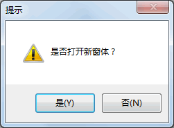

> 提示：消息框中的提示文字、图标、按钮等外观设置也可以通过设置消息框中的相应参数来改变。

## 6.控件简介

在 Windows 窗体应用程序中每个窗体都是由若干个控件构成的。

所谓控件就是人们常说的能输入文本的位置、能选择的位置、能单击的位置、图片显示的位置等。其中：

* 能输入文本的位置对应于 Windows 窗体应用程序中的文本框、多行文本框等。
* 能选择的位置对应于 Windows 窗体应用程序中的复选框、单选按钮、下拉列表框。
* 能单击的位置对应于 Windows 窗体应用程序中的按钮、超链接标签、菜单栏、工具栏等。
* 图片显示的位置对应于 Windows 窗体应用程序中的图片控件。

常用的 QQ 软件的登录界面如下图所示。


在该界面中可以看到主要包括用于输入“QQ 号码”和“密码”的文本框，用于选择“记住密码”和“自动登录”的复选框，用于单击“注册账号”和“找回密码”的超链接标签、用于登录 QQ 的“安全登录”按钮，以及显示“QQ 图标”的图片控件。

Windows 窗体应用程序的实现主要依靠控件，并通过控件的事件和属性来实现窗体的效果。

Windows 窗体应用程序的设计与 Windows 操作系统的界面有些相似，所提供的控件也相似，包括菜单栏、工具栏、对话框等，灵活地使用 Windows 窗体应用程序中所提供的控件能设计出符合客户要求、美观合理的界面。

## 7.Label和LinkLabel 标签控件

在 Windows 窗体应用程序中，每个窗体都必不可少地会用到文本框和标签控件。

由于在窗体中无法直接编写文本，通常使用标签控件来显示文本。

关于文本框的应用我们将在下一节《C# TextBox》中为大家讲解。

在 Windows 窗体应用程序中，标签控件王要分为普通的标签 (Label) 和超链接形式的标签 (LinkLabel) 。

普通标签 (Label) 控件的常用属性如下表所示。

| 属性名    | 作用                                                         |
| --------- | ------------------------------------------------------------ |
| Name      | 标签对象的名称，区别不同标签唯一标志                         |
| Text      | 标签对象上显示的文本                                         |
| Font      | 标签中显示文本的样式                                         |
| ForeColor | 标签中显示文本的颜色                                         |
| BackColor | 标签的背景颜色                                               |
| Image     | 标签中显示的图片                                             |
| AutoSize  | 标签的大小是否根据内容自动调整，True 为自动调整，False 为用户自定义大小 |
| Size      | 指定标签控件的大小                                           |
| Visible   | 标签是否可见，True 为可见，False 为不可见                    |

普通标签控件 (Label) 中的事件与窗体的事件类似，常用的事件主要有鼠标单击事件、 鼠标双击事件、标签上文本改变的事件等。

与普通标签控件类似，超链接标签控件 (LinkLabel) 也具有相同的属性和事件。

超链接标签主要应用的事件是鼠标单击事件，通过单击标签完成不同的操作，例如在 QQ 窗体中注册账号和找回密码的操作。

下面通过实例来演示标签控件的应用。

【实例】创建一个窗体，在窗体上放置两个普通标签控件 (Label)，分别显示“早上好！”和“GoodMorning！”。

在窗体上通过单击超链接标签 (LinkLabel) 交换这两个标签上显示的信息。

根据题目要求，首先创建一个名为 ChangeTextForm 的窗体，并设置所需控件的属性和事件，实现的代码如下。

```
public partial class ChangeTextForm : Form{    public ChangeTextForm()    {        InitializeComponent();    }    //超链接标签控件的单击事件    private void linkLabel1_LinkClicked(object sender, LinkLabelLinkClickedEventArgs e)    {        //交换标签上的信息。        string temp = label1.Text;        label1.Text = label2.Text;        label2.Text = temp;    }}
```

> 提示：所需控件可以在工具箱中创建，在控件上右键即可设置相关属性和事件

执行上面的代码，效果如下图所示。

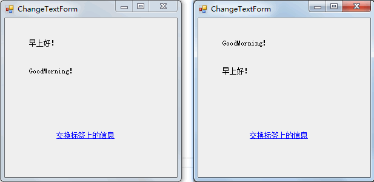

## 8.TextBox：文本框控件
## 9.Button：按钮控件
## 10.RadioButton：单选按钮控件
## 11.CheckBox：复选框控件
## 12.CheckedListBox：复选列表框控件
## 13.ListBox：列表框控件
## 14.ComboBox：组合框控件
## 15.PictureBox：图片控件
## 16.Timer：定时器控件
## 17.DateTimePicker：日期时间控件
## 18.日历控件（MonthCalendar）
## 19.ContextMenuStrip：右键菜单控件（上下文菜单）
## 20.MenuStrip：菜单栏控件
## 21.StatusStrip：状态栏菜单控件
## 22.ToolStrip：工具栏控件
## 23.MDI窗体
## 24.ColorDialog：颜色对话框控件
## 25.FontDialog：字体对话框控件
## 26.OpenFileDialog和SaveFileDialog：打开文件与保存文件
## 27.RichTextBox：富文本框控件


