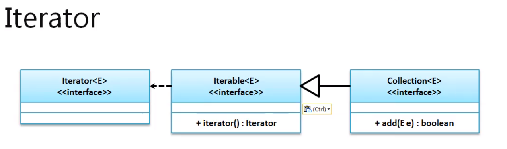
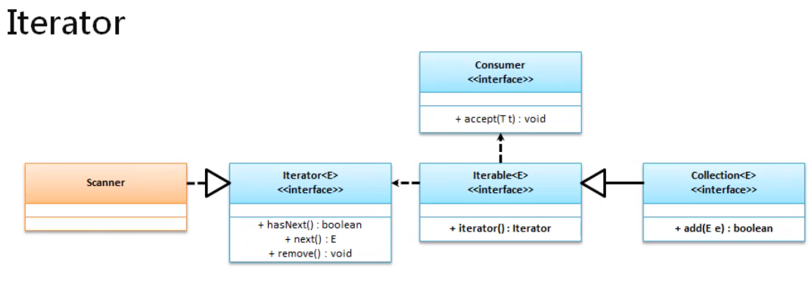
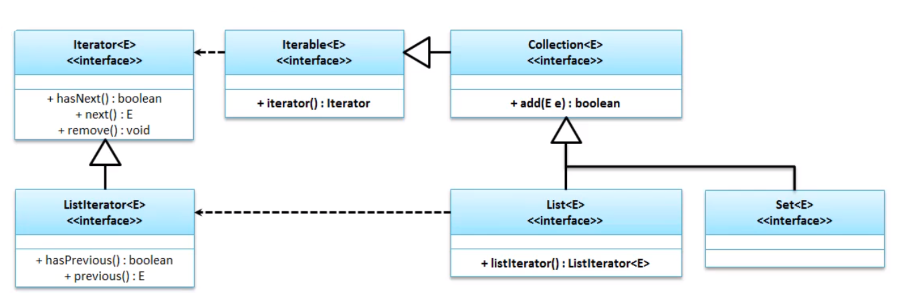
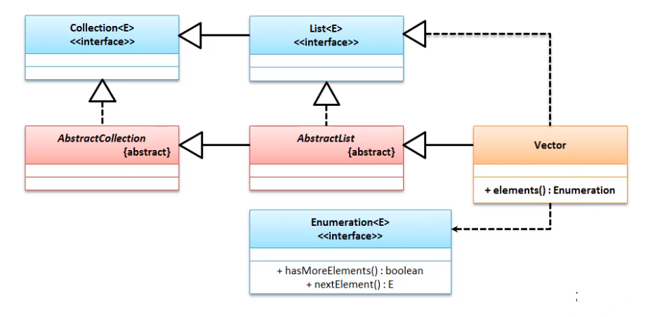

# 遍历

遍历的四种模式

- Iterator
- ListIterator
- Enumeration
- Foreach

## Iterator 迭代输出

跌点 : 是一种循环结构的另类称呼 , 可以简单的理解为 : 在若干个数据上逐个判断 , 如果有就继续输出 ;

在Collection接口实现了Iterator的接口



java.lang.Iterable

| 方法                                             | 释义                   |
| ------------------------------------------------ | ---------------------- |
| default void forEach(Consumer<? super ?> action) | 消费处理               |
| Iterator<T> Iterator                             | 获取Iterator接口的实例 |

Iterator是java集中定义的集合数据的标准输出接口 , 其中定义了如下的几个方法 :

| 方法                     | 释义             |
| ------------------------ | ---------------- |
| public boolean hasNext() | 判断有没有下一个 |
| public E next()          | 返回下一个的对象 |
| default void remove()    | 删除当前元素     |



只要是Collection的子类 , 都可以使用 Iterator的方法获取Iterator的实例 . 

范例 : 实现集合内容的输出

```java
public static void main(String[] args) throws Exception {
    Set set = Set.of("b","c","l","p");
    Iterator iterator = set.iterator();
    while (iterator.hasNext()){
        System.out.println(iterator.next());
    }
}
```

结果 :

```cmd
b
c
p
l
```

> ==迭代操作的特点是只进行一次循环处理 , 但是使用使用了get()方法 , 每次都需要寻找一次元素 , get()方法的时间复杂度很高 ; 所以性能不是很高==

但是在使用Iterator的 remove()方法 , 他与Collection接口中的区别:

- Collection中的remove();  在循环中会有异常 ;
- Iterator中的remove(); Iterator 迭代删除就不会有异常 ;

从jdk1.8中开始 , 由于追加了Lambda表达式 , 以及方法引用和功能型接口 , 如果只是作为显示 , 器使用方法如下 :

范例 :

```java
List all = List.of("你好","世界","我叫","luke");
Iterator iterator = all.iterator();

all.forEach(System.out::print);
```

结果:

```cmd
你好世界我叫luke
```

关于这个操作智能当娱乐出现 , 最好是使用Iterator;

## ListIterator 双向迭代

> Collection 实现了 Iterator 接口的实例化方法 , 但是并没有 实现ListIterator的实例化方法 , 而 List 实现了 ListIterator 的实现方法 , 所以它属于 List 的实现类



不同的方法 :

| 方法                   | 释义             |
| ---------------------- | ---------------- |
| boolean hasPrevious(); | 是否有上一个元素 |
| E previous();          | 获取上一个元素   |

范例 : 

``` java
List all = List.of("你好","世界","我叫","luke");
ListIterator listIterator = all.listIterator();
System.out.println("正向迭代");
while (listIterator.hasNext()){
    System.out.print("["+listIterator.next()+"]");
}
System.out.println("\n反向迭代");
while (listIterator.hasPrevious()){
    System.out.print("["+listIterator.previous()+"]");
}
System.out.println("\n反向迭代");
while (listIterator.hasPrevious()){
    System.out.print("["+listIterator.previous()+"]");
}
```

结果

```cmd
正向迭代
[你好][世界][我叫][luke]
反向迭代
[luke][我叫][世界][你好]
反向迭代
```

> 由于最后一次反向迭代之前 , 已经进行了一次反向迭代 , 所以指针指在第一个 , 这个时候再次使用反向迭代 , 第一个之前就是为空 , 所以并没有打印出结果

## Enumeratiom 枚举输出

在jdk1.0的时候为了方便Vector集合输出 , 在Enumeration接口最初的时候只定义了两个操作方法 . 

| 方法                      | 释义                 |
| ------------------------- | -------------------- |
| boolean hasMoreElements() | 判断是否有下一个元素 |
| E nextElement()           | 获取下一个元素       |

Iteration 接口与Enumeration 接口的核心功能非常相似 , 但是优点在于 : 

- Iteration 是个标准 ;
- 方法名称简短 ; 
- 并没有任何一个集合拥有获取 Enumeration 对象的方法 ;
- 只有 Vector 这个古老的类 有对应的方法
  - `public Enumeration<E> elements()`



范例 : 

```java
Vector<String> vector = new Vector<String>();
vector.add("Hello");
vector.add("Java");
vector.add("Luke");
vector.add("lei");
vector.add("ming");
Enumeration<String> elements = vector.elements();
while (elements.hasMoreElements()){
    System.out.println(elements.nextElement());
}

```

结果

```cmd
Hello
Java
Luke
lei
ming
```

这种输出操作属于一个古老的方法 , 尽量不使用这种方法 ; 但是要记住 !

## foreach

在 jdk1.5 追加了 foreach 输出操作 , 但是这个输出操作不仅仅只在数组上使用 , 也可以使用到类集中 ;

范例 :

```java
Set<String> set = new HashSet<>();
set.add("a");
set.add("b");
set.add("c");
set.add("d");
set.add("e");
for (String str : set) {
    System.out.println(str);
}
```

以上操作使用了与数组对等的结构实现了内容输出 , 但是有一个问题 ;

#### 面试题

请问如何可以将一个自定义的类利用foreach输出 ?

- 要想实现自定义类foreach输出 , 则这个类一定要实现 Iterable 接口;

  范例 : 

  ```java
  import java.util.*;
  
  interface ILink<T> extends Iterable<String> {
      void add(T data);
  }
  ```
  ```java
  class MyLink<T> implements ILink<T> {
      private Node root;
      private Node last;//保存最后一个 , 方便快速添加
      private Node currentNode;//保存输出的最后一个节点
  
      @Override
      public void add(T data) {
          Node newNode = new Node(data);
          if (this.root == null) {
              this.root = newNode;
          } else {
              this.last.next = newNode;
          }
          this.last = newNode;
      }
  
      @Override
      public Iterator iterator() {
          this.currentNode = this.root;// 输出从根源开始
          return new LinkIterator();
      }
  
      private class Node {
          private T data;
          private Node next;
  
          Node(T data) {
              this.data = data;
          }
      }
  
      class LinkIterator implements Iterator<T> {
          @Override
          public boolean hasNext() {
              return MyLink.this.currentNode != null;
          }
  
          @Override
          public T next() {
              T data = MyLink.this.currentNode.data;
              MyLink.this.currentNode = MyLink.this.currentNode.next;
              return data;
          }
      }
  
  }
  ```
  ```java
  public class Main {
      public static void main(String[] args) {
                         ILink<String> link = new MyLink<String>();
          link.add("a");
          link.add("b");
          link.add("c");
          link.add("d");
          link.add("e");
          for (String str : link) {
              System.out.println(str);
          }
      }
  }
  ```
  
  结果

  ```cmd
a
  b
  c
  d
  e
  ```
  
  


# 面试题 :

List接口中存在有get()方法 , 可以根据索引获取数据 , 那么请问使用和Iterator有哪些不同?

- List 相比较 Set 和 Collection 来讲 , 最大的区别在于 它支持  get()方法
- 迭代操作的特点是只进行一次循环处理 , 但是使用使用了get()方法 , 每次都需要寻找一次元素 , get()方法的时间复杂度很高 ;