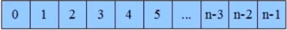

# ArrayList源码分析

## 1. 数字介绍

   * 数组是数据结构中很基本的结构,很多编程语言都内置数组。

   * 在java中当创建数组时会在内存中划分出一块连续的内存,然后当有数据进入的时候会将数据按顺序的存储在 ,这块连续的内存中。

   * 当需要读取数组中的数据时,需要提供数组中的索引,然后数组根据索引将内存中的数据取出来,返回给读取程序。

   * 在Java中并不是所有的数据都能存储到数组中,只有相同类型的数据才可以一起存储到数组中。

     

   > 因为数组在储存数据的时是按顺序存储的 ，存储数据的内存也是连续的，所以他的特点就是**寻址读取数据比较容易，插入和删除比较困难**

## 2. 源码

### 1. 构造方法

   ```java
   // 空参构造方法
   public ArrayList() {
       this.elementData = DEFAULTCAPACITY_EMPTY_ELEMENTDATA;
   }
   // 创建指定长度的数组
   public ArrayList(int initialCapacity) {
       if (initialCapacity > 0) {
           this.elementData = new Object[initialCapacity];
       } else if (initialCapacity == 0) {
           this.elementData = EMPTY_ELEMENTDATA;
       } else {
           throw new IllegalArgumentException("Illegal Capacity: "+
                                              initialCapacity);
       }
   }
   
   public ArrayList(Collection<? extends E> c) {
       elementData = c.toArray();
       if ((size = elementData.length) != 0) {
           // c.toArray might (incorrectly) not return Object[] (see 6260652)
           if (elementData.getClass() != Object[].class)
               elementData = Arrays.copyOf(elementData, size, Object[].class);
       } else {
           // replace with empty array.
           this.elementData = EMPTY_ELEMENTDATA;
       }
   }
   ```
### 2. 插入数据

```java
public boolean add(E e) {
    // 监测是否需要扩容
    ensureCapacityInternal(size + 1);  // Increments modCount!!
    // 数组赋值
    elementData[size++] = e;
    return true;
}

public void add(int index, E element) {
    //判断index是否越界
    rangeCheckForAdd(index);
	// 监测是否需要扩容
    ensureCapacityInternal(size + 1);  // Increments modCount!!
    // 将index之后所有的元素复制后,从index+1位置粘贴
    System.arraycopy(elementData, index, elementData, index + 1, size - index);
    // 给index赋值
    elementData[index] = element;
    // 大小加一
    size++;
}
```

###  3. 扩容

```java
// 检查是否需要扩容
private void ensureCapacityInternal(int minCapacity) {
    // 如果是空数组
    if (elementData == DEFAULTCAPACITY_EMPTY_ELEMENTDATA) {
        // 使用默认长度 10
        minCapacity = Math.max(DEFAULT_CAPACITY, minCapacity);
    }
	// 确保最小容量
    ensureExplicitCapacity(minCapacity);
}

private void ensureExplicitCapacity(int minCapacity) {
    // 修改次数加 1
    modCount++;
    // 最小容量 - 当前容量 > 0 表示容量不足
    if (minCapacity - elementData.length > 0)
        // 进行扩容操作
        grow(minCapacity);
}

private void grow(int minCapacity) {
    // 获取旧的长度
    int oldCapacity = elementData.length;
    // 新的长度是旧的 1.5倍
    int newCapacity = oldCapacity + (oldCapacity >> 1);
    // 如果新的大小 < 需求最小容量
    if (newCapacity - minCapacity < 0)
        // 新容量 = 需求最小容量
        newCapacity = minCapacity;
    // 如果 新容量 超过最大容量
    if (newCapacity - MAX_ARRAY_SIZE > 0)
        newCapacity = hugeCapacity(minCapacity);
    // 将旧数据复制到新的数组中
    elementData = Arrays.copyOf(elementData, newCapacity);
}
```

### 4. 删除方法

```java
// 指定下标删除
public E remove(int index) {
    // 检查 index
    rangeCheck(index);
	// 修改次数加 1
    modCount++;
    // 取出index的元素
    E oldValue = elementData(index);
	// 计算需要移动多少个元素
    int numMoved = size - index - 1;
    // 需要移动的数据大于 0
    if (numMoved > 0)
        // 将 index+1 之后的元素 移动到 index开始的位置
        System.arraycopy(elementData, index+1, elementData, index, numMoved);
    // 将长度最后的元素 变为 null , 并且长度 -1
    elementData[--size] = null; // clear to let GC do its work
	// 返回删除的数据
    return oldValue;
}

// 指定元素删除
public boolean remove(Object o) {
    // 判断元素是否为空
    if (o == null) {
        // 遍历所有
        for (int index = 0; index < size; index++)
            // 删除所有的null
            if (elementData[index] == null) {
                fastRemove(index);
                return true;
            }
    } else {
        // 遍历所有
        for (int index = 0; index < size; index++)
            // 如果相等
            if (o.equals(elementData[index])) {
                // 删除
                fastRemove(index);
                return true;
            }
    }
    // 如果没有匹配元素,返回false
    return false;
}

// 快速删除 与 remove 少了 监测方法
private void fastRemove(int index) {
    modCount++;
    int numMoved = size - index - 1;
    if (numMoved > 0)
        System.arraycopy(elementData, index+1, elementData, index,
                         numMoved);
    elementData[--size] = null; // clear to let GC do its work
}
```

## 3. 异常

1. 发生场景 : 

```java
for (String str : arrayList) {
    if ("4".equals(str)) {
        arrayList.remove(str);
    }
}
```

2. 抛出异常

```cmd
java.util.ConcurrentModificationException
	at java.util.ArrayList$Itr.checkForComodification(ArrayList.java:901)
	at java.util.ArrayList$Itr.next(ArrayList.java:851)
```

3. 原因 : 在迭代时使用 next(); 会校验修改次数和预期修改次数是否相等

```java
public E next() {
    checkForComodification();
    int i = cursor;
    if (i >= size)
        throw new NoSuchElementException();
    Object[] elementData = ArrayList.this.elementData;
    if (i >= elementData.length)
        throw new ConcurrentModificationException();
    cursor = i + 1;
    return (E) elementData[lastRet = i];
}

final void checkForComodification() {
    if (modCount != expectedModCount)
        throw new ConcurrentModificationException();
}
```

4. 解决方案 : 
   1. 使用  for 循环

       ```java
       for (int i = 0; i < arrayList.size(); i++) {
           if ("4".equals(arrayList.get(i))) {
               arrayList.remove(i);
           }
       }
       ```

   2. 使用 Iterator 迭代器

       ```java
       Iterator i = arrayList.iterator();
       while(i.hasNext()){
           if ("4".equals(i.next())){
               i.remove();
           }
       }
       ```

   