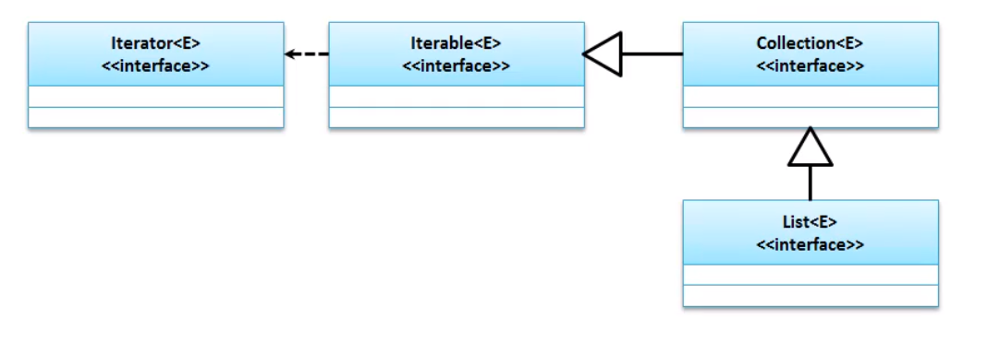
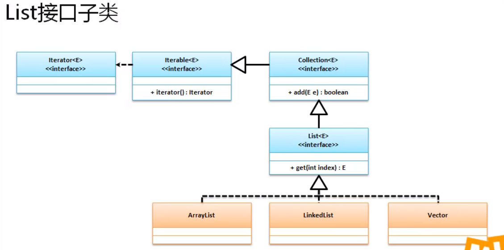
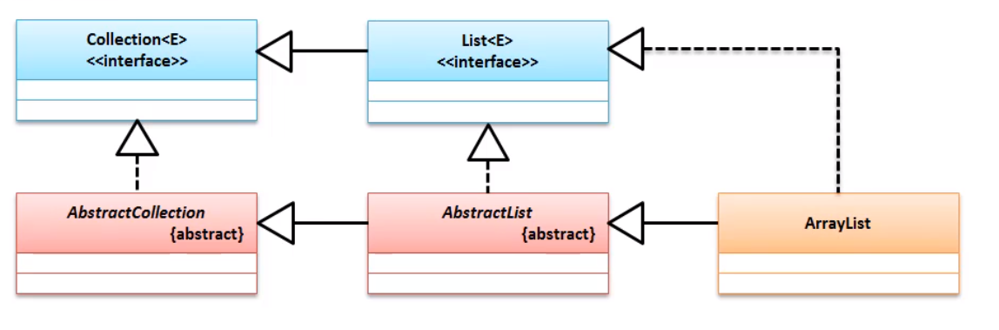
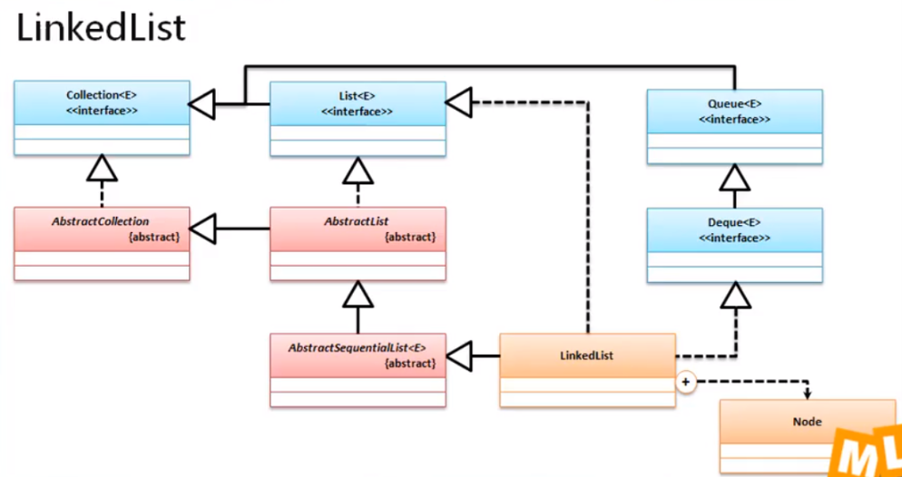
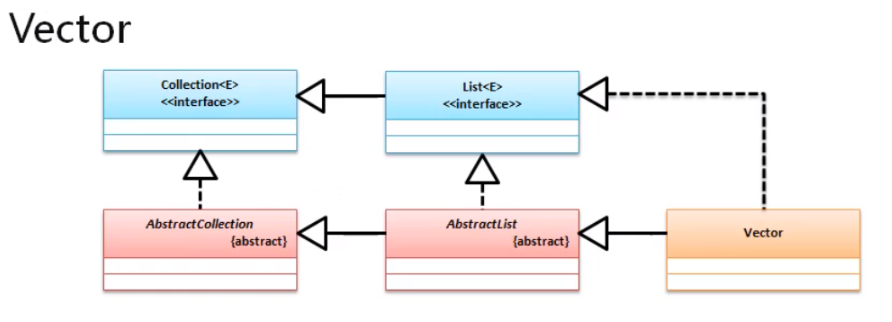

# List 接口



主要与Collection不一样的方法

| 方法                                 | 描述                                                         |
| :----------------------------------- | :----------------------------------------------------------- |
| void add(int index, E element)       | 向集合指定索引加入元素                                       |
| ==E get(int index)==                 | 向集合中追加一组数据                                         |
| ListIterator<E> listIterator()       | 获取ListIterator接口的实例                                   |
| static <E> List<E> of(E... elements) | 通过指定的内容创建List  ==(1.9之后才有)== 创建不能修改的List集合 |
| int indexOf(Object o)                | 获取该对象在List中的索引                                     |

# 常用子类



- ArrayList
- LinkedList
- Vector

## 一. ArrayList



### 源码分析

#### 1. 构造方法

   ```java
   // 空参构造方法
   public ArrayList() {
       this.elementData = DEFAULTCAPACITY_EMPTY_ELEMENTDATA;
   }
````
   ```java
   // 创建指定长度的数组
   public ArrayList(int initialCapacity) {
       if (initialCapacity > 0) {
           this.elementData = new Object[initialCapacity];
       } else if (initialCapacity == 0) {
           this.elementData = EMPTY_ELEMENTDATA;
       } else {
           throw new IllegalArgumentException("Illegal Capacity: "+
                                              initialCapacity);
       }
   }
   ```
   ```java
   public ArrayList(Collection<? extends E> c) {
       elementData = c.toArray();
       if ((size = elementData.length) != 0) {
           // c.toArray might (incorrectly) not return Object[] (see 6260652)
           if (elementData.getClass() != Object[].class)
               elementData = Arrays.copyOf(elementData, size, Object[].class);
       } else {
           // replace with empty array.
           this.elementData = EMPTY_ELEMENTDATA;
       }
   }
   ```
#### 2. 插入数据

```java
public boolean add(E e) {
    // 监测是否需要扩容
    ensureCapacityInternal(size + 1);  // Increments modCount!!
    // 数组赋值
    elementData[size++] = e;
    return true;
}
```
```java
public void add(int index, E element) {
    //判断index是否越界
    rangeCheckForAdd(index);
	// 监测是否需要扩容
    ensureCapacityInternal(size + 1);  // Increments modCount!!
    // 将index之后所有的元素复制后,从index+1位置粘贴
    System.arraycopy(elementData, index, elementData, index + 1, size - index);
    // 给index赋值
    elementData[index] = element;
    // 大小加一
    size++;
}
```

####  3. 扩容

```java
// 检查是否需要扩容
private void ensureCapacityInternal(int minCapacity) {
    // 如果是空数组
    if (elementData == DEFAULTCAPACITY_EMPTY_ELEMENTDATA) {
        // 使用默认长度 10
        minCapacity = Math.max(DEFAULT_CAPACITY, minCapacity);
    }
	// 确保最小容量
    ensureExplicitCapacity(minCapacity);
}

private void ensureExplicitCapacity(int minCapacity) {
    // 修改次数加 1
    modCount++;
    // 最小容量 - 当前容量 > 0 表示容量不足
    if (minCapacity - elementData.length > 0)
        // 进行扩容操作
        grow(minCapacity);
}

private void grow(int minCapacity) {
    // 获取旧的长度
    int oldCapacity = elementData.length;
    // 新的长度是旧的 1.5倍
    int newCapacity = oldCapacity + (oldCapacity >> 1);
    // 如果新的大小 < 需求最小容量
    if (newCapacity - minCapacity < 0)
        // 新容量 = 需求最小容量
        newCapacity = minCapacity;
    // 如果 新容量 超过最大容量
    if (newCapacity - MAX_ARRAY_SIZE > 0)
        newCapacity = hugeCapacity(minCapacity);
    // 将旧数据复制到新的数组中
    elementData = Arrays.copyOf(elementData, newCapacity);
}
```

#### 4. 删除方法

```java
// 指定下标删除
public E remove(int index) {
    // 检查 index
    rangeCheck(index);
	// 修改次数加 1
    modCount++;
    // 取出index的元素
    E oldValue = elementData(index);
	// 计算需要移动多少个元素
    int numMoved = size - index - 1;
    // 需要移动的数据大于 0
    if (numMoved > 0)
        // 将 index+1 之后的元素 移动到 index开始的位置
        System.arraycopy(elementData, index+1, elementData, index, numMoved);
    // 将长度最后的元素 变为 null , 并且长度 -1
    elementData[--size] = null; // clear to let GC do its work
	// 返回删除的数据
    return oldValue;
}

// 指定元素删除
public boolean remove(Object o) {
    // 判断元素是否为空
    if (o == null) {
        // 遍历所有
        for (int index = 0; index < size; index++)
            // 删除所有的null
            if (elementData[index] == null) {
                fastRemove(index);
                return true;
            }
    } else {
        // 遍历所有
        for (int index = 0; index < size; index++)
            // 如果相等
            if (o.equals(elementData[index])) {
                // 删除
                fastRemove(index);
                return true;
            }
    }
    // 如果没有匹配元素,返回false
    return false;
}

// 快速删除 与 remove 少了 监测方法
private void fastRemove(int index) {
    modCount++;
    int numMoved = size - index - 1;
    if (numMoved > 0)
        System.arraycopy(elementData, index+1, elementData, index,
                         numMoved);
    elementData[--size] = null; // clear to let GC do its work
}
```

#### 3. 异常

1. 发生场景 : 

```java
for (String str : arrayList) {
    if ("4".equals(str)) {
        arrayList.remove(str);
    }
}
```

2. 抛出异常

```cmd
java.util.ConcurrentModificationException
	at java.util.ArrayList$Itr.checkForComodification(ArrayList.java:901)
	at java.util.ArrayList$Itr.next(ArrayList.java:851)
```

3. 原因 : 在迭代时使用 next(); 会校验修改次数和预期修改次数是否相等

```java
public E next() {
    checkForComodification();
    int i = cursor;
    if (i >= size)
        throw new NoSuchElementException();
    Object[] elementData = ArrayList.this.elementData;
    if (i >= elementData.length)
        throw new ConcurrentModificationException();
    cursor = i + 1;
    return (E) elementData[lastRet = i];
}

final void checkForComodification() {
    if (modCount != expectedModCount)
        throw new ConcurrentModificationException();
}
```

4. 解决方案 : 
   1. 使用  for 循环

       ```java
       for (int i = 0; i < arrayList.size(); i++) {
           if ("4".equals(arrayList.get(i))) {
               arrayList.remove(i);
           }
       }
       ```

   2. 使用 Iterator 迭代器

       ```java
       Iterator i = arrayList.iterator();
       while(i.hasNext()){
           if ("4".equals(i.next())){
               i.remove();
           }
       }
       ```


## 二.LinkedList

继承关系



### 1.节点处理类

```java
private static class Node<E> { // 不需要外部进行访问 , 双向链表
    E item; // 存放数据
    Node<E> next; // 下一个节点
    Node<E> prev; // 上一个节点

    Node(Node<E> prev, E element, Node<E> next) {
        this.item = element;
        this.next = next;
        this.prev = prev;
    }
}
```

### 2.头尾

```java
//transient (关键字,不能序列化)
transient Node<E> first;  // 第一个节点 
transient Node<E> last; // 最后一个节点
```

### 3. 插入方法

#### a. 插入单个

```java
public boolean add(E e) {
    linkLast(e);
    return true;
}

void linkLast(E e) {
    final Node<E> l = last;
    final Node<E> newNode = new Node<>(l, e, null);
    // 设置新节点是尾节点
    last = newNode;
    // 判断链表是否有元素
    if (l == null)
        first = newNode;
    else
       	// 设置尾节点的后记节点为空
        l.next = newNode;
    size++;
    modCount++;
}
// 内部类
private static class Node<E> {
    E item;// 当前节点
    Node<E> next;// 后继节点
    Node<E> prev;// 前继节点

    Node(Node<E> prev, E element, Node<E> next) {
        this.item = element;
        this.next = next;
        this.prev = prev;
    }
}
```

#### b. 插入到指定位置

```java
public void add(int index, E element) {
    // 检查下标是否合法 ( index >=0 && index <= size )
    checkPositionIndex(index);
	// 是否为尾部节点
    if (index == size)
        // 添加到尾部
        linkLast(element);
    else
        // 插入节点
        // element 插入的元素
        // node(index) 原先 这个位置的节点
        linkBefore(element, node(index));
}

void linkBefore(E e, Node<E> succ) {
    // 原来节点的前集节点
    final Node<E> pred = succ.prev;
    // 创建节点 , 原来节点的前节点是新节点的前继节点 , 原来的节点是新节点的后继节点
    final Node<E> newNode = new Node<>(pred, e, succ);
    // 原节点的前节点是新节点
    succ.prev = newNode;
    // 如果原前继节点为空
    if (pred == null)
        // 插入的节点为第一个节点
        first = newNode;
    else
        // 前继节点 的 后继节点 是新节点
        pred.next = newNode;
    // 改变长度
    size++;
    // 修改次数
    modCount++;
}

```

### 4. 删除

#### a. 删除1

```java
public E remove() {
    return removeFirst();
}

public E removeFirst() {
    final Node<E> f = first;
    if (f == null)
        throw new NoSuchElementException();
    return unlinkFirst(f);
}
private E unlinkFirst(Node<E> f) {
    // assert f == first && f != null;
    final E element = f.item;
    final Node<E> next = f.next;
    f.item = null;
    f.next = null; // help GC
    first = next;
    if (next == null)
        last = null;
    else
        next.prev = null;
    size--;
    modCount++;
    return element;
}
```

#### b. 删除2

```java
public boolean remove(Object o) {
    if (o == null) {
        for (Node<E> x = first; x != null; x = x.next) {
            if (x.item == null) {
                unlink(x);
                return true;
            }
        }
    } else {
        for (Node<E> x = first; x != null; x = x.next) {
            if (o.equals(x.item)) {
                unlink(x);
                return true;
            }
        }
    }
    return false;
}

E unlink(Node<E> x) {
    // assert x != null;
    // x 要删除的节点
    final E element = x.item;
    final Node<E> next = x.next;
    final Node<E> prev = x.prev;
	// 是头部节点
    if (prev == null) {
        // 头部节点 = x.后继节点
        first = next;
    } else {
        // x.前继节点的后继节点 = 后继节点
        prev.next = next;
        // x.前继节点 = null
        x.prev = null;
    }
	// 是尾部节点
    if (next == null) {
        // 尾部节点 = x.前继节点
        last = prev;
    } else {
        // x.后继节点.前继节点 = x.前继节点
        next.prev = prev;
        // x.后继节点 = null
        x.next = null;
    }
	// x清空
    x.item = null;
    // 长度减 1
    size--;
    // 修改次数加 1
    modCount++;
    return element;
}
```

#### c. 删除3

```java
public E remove(int index) {
    // 检查index位置 index >= 0 && index < size;
    checkElementIndex(index);
    // 删除(删除2引用的方法)
    return unlink(node(index));
}

```

### 4. 查找

```java
public E get(int index) {
    checkElementIndex(index);
    return node(index).item;
}
// 获取index的元素
Node<E> node(int index) {
    // assert isElementIndex(index);
    if (index < (size >> 1)) {
        // 从前面开始找
        Node<E> x = first;
        for (int i = 0; i < index; i++)
            x = x.next;
        return x;
    } else {
        // 从后面开始找
        Node<E> x = last;
        for (int i = size - 1; i > index; i--)
            x = x.prev;
        return x;
    }
}
```


## 三.Vector 

Vector (jdk1.0) 是最早的实现集合处理的操作类 , 在JDK1.0中就有 , 表示"向量" , 但是到了 JDK1.2之后 , 最早的工程师想把 Vector 取消 , 但是由于有些框架还会使用 , 所以 多继承了 List 接口 .

它和ArrayList十分相似 ;



Vector 是 synchronize (线程安全的) , 而ArrayList并未采用 synchronize . 所以读取使用ArrayList , 如果牵扯到 线程安全 请使用 Vector

> 由于他们都实现了List 接口进行实例化处理 , 所以使用任意子类最终的效果都是相同的 , 只有每个子类的实现方法有区别 .

# 面试题 : 

请解释ArrayList 和 Linkedl 区别 ?

- ArrayList 是基于数组实现的 , 而 LinkedList 是基于链表实现的;
- ArrayList 查询是"O(1)" , LinkedList 查询是"O(n)"

请解释ArrayList与Vector的区别 ?

- ArrayList 是在 jdk是在 1.2 提出的 , 其方法没有使用线程同步锁 ;
- Vector 是在jdk1.0出现的 , 在jdk1.2融入到集合框架中的 , 所有的方法都使用 线程同步锁 , 所以Vertor是线程安全的 ;
- ArrayList 和Vector的实现功能基本一致 , 使用方法也是基本一致的;