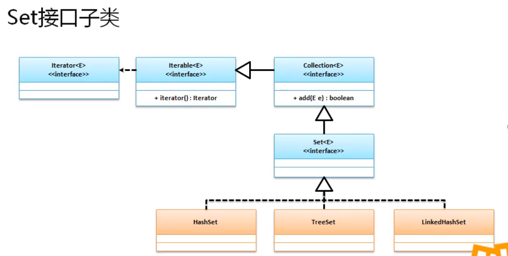

# Set

Set接口和List接口都属于Collection接口 , Set接口的最大特点是元素不能重复 ;

```java
public interface Set<E> extends Collection<E>
```

在jdk1.9之前 , Set接口并没有对Collection接口的方法进行扩充 , 即两个接口的方法是完全一致的(Set接口没有 List 中的`get`方法) , 只不过在1.9之后 添加了 of 等方法 ; 

不可以存储相同的数据 ;

 ```java
Set set = Set.of("Hello","MLXX","Hello");
 ```

结果

```java
Exception in thread "main" java.lang.IllegalArgumentException: duplicate element: Hello
```

存储是 , 增加顺序不是保存顺序

```java
Set set = Set.of("Hello","MLXX");
System.out.println(set);
```

```cmd
[MLXX, Hello]
```


> 此时创建的Set集合不可以 , 进行修改 

## 常用子类

- HashSet - 散列存储
- TreeSet - 有序储存
- LinkedSet - 链表存储



# 一.HashSet( 90%)

## 1. 定义结构


# 二.TreeSet

# 三.LinkedSet