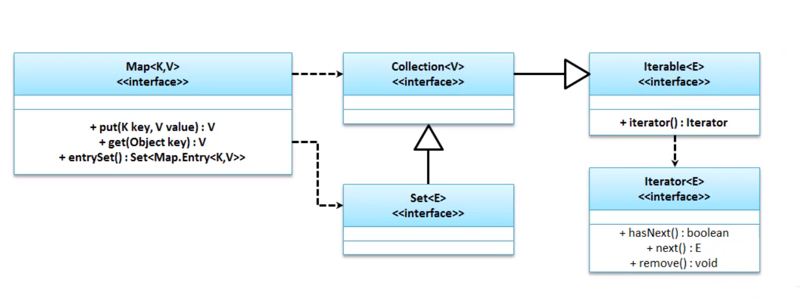
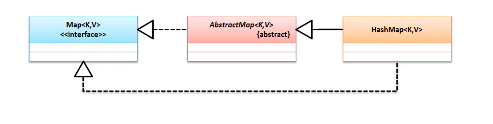
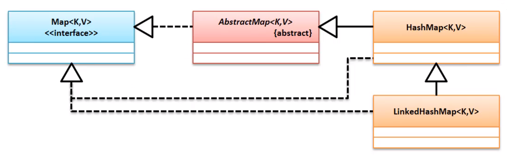
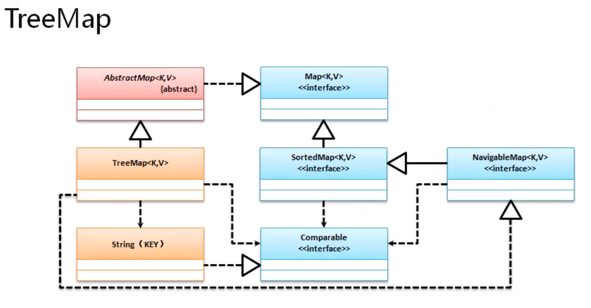

# Map

集合根据数据存储的不同分为两种格式 : 单只集合 、二元偶对象集合 , 在Collection中都是属于单值集合 , 而二元偶对象集合则是使用`key=value`的结构 , 在使用的时候根据 `key`寻找`value`的值 , 所以 Collection 和 Map 存储数据的目的为 : ==Collection 是为了数据的输出而设计的 , Map 是为了数据的查询而存在的== ;

## Map 简介

`java.util.Map`是进行二元偶对象数据存储的最大父接口 , 里面的所有存储的数据都会按照`key=value`的形式进行保存 , 所以在数据存放时 需要用到两个内容 ; 

方法如下 :

| 方法                               | 释义                                |
| :--------------------------------- | ----------------------------------- |
| ==V put(K key, V value)==          | ==向集合中保存数据==                |
| ==V get(Object key)==              | ==通过key查询对应内容==             |
| V remove(Object key)               | 根据key删除对应数据                 |
| int size()                         | 获取集合长度                        |
| Collection<V> values()             | 返回所有的内容                      |
| Set<K> keySet()                    | 获取所有的key                       |
| ==Set<Map.Entry<K,V>> entrySet()== | ==将所有的内容以Map.Entry形式返回== |



在jdk1.9之后 , 在MAP接口中有`of`方法 , 他可以创建一个Map集合 ;

范例 :

```java
Map<String, Integer> map = Map.of("one", 1, "two", 2, "three", 3);
        System.out.println(map);
```

结果 :

```cmd
{three=3, two=2, one=1}
```

> 如果 `key`重复则会抛出异常 `Exception in thread "main" java.lang.IllegalArgumentException: duplicate key: three`

因为`key`作为Map操作的核心控制点 , 所以这个内容的重复实际上对于整个的Map==而言就需要进行更新== ; 如果想正确使用MAP的接口 , 就要使用Map的子类 :

- HashMap
- LinkedHashMap
- TreeMap
- HashTable

## HashMap

HashMap 是 Map 接口中最为常见的一个子类 , 也是主要是用的一个子类 , 此类采用Hash的方式进行存储 , 所以存储的时候都是无序的 . 




> null 可以为 `key` 也可以为 `value` , put时返回被替换的值 ;

HashMap 在 1.8 之后有了重大的变更

- 默认阈值 : `static final float DEFAULT_LOAD_FACTOR = 0.75f;`

- 默认大小 : `static final int DEFAULT_INITIAL_CAPACITY = 1 << 4; // aka 16`

- 最大存储 : `static final int MAXIMUM_CAPACITY = 1 << 30;`

- 扩容 : ==每次扩容1倍== `newCap = oldCap << 1`

- 扩容时机 : 当前的存储容量达到了75%(75%是阈值)

- 性能保证 : ==树状阈值==`static final int TREEIFY_THRESHOLD = 8;`

  ```java
  if (binCount >= TREEIFY_THRESHOLD - 1) // -1 for 1st
      treeifyBin(tab, hash);
  break;
  ```

  如果在1.8之后 , HashMap的数据存储容量达到了8位 , HashMap会将链表的存储结构改为红黑树结构 , 可以利用红黑树的特点做到查询的性能最优

## LinkedHashMap

HashMap之中进行数据存储的时候并不会进行顺序的定义 , 如果现在想要实现顺序的存储 , 就可以利用 LinkedHashMap 来完成 ; 



```java
Map map = new LinkedHashMap();
map.put("one","1");
map.put("four","4");
map.put("two","2");
map.put("five","5");
map.put("three","3");
System.out.println(map);
```

结果

```cmd
{one=1, four=4, two=2, five=5, three=3}
```

> 除了存入的内容的顺序排序之外 , 与HashMap并没有太大的区别


## TreeMap

`java.util.TreeMap` 依据了`key`的自然排序 , 进行排序




> - 因为排序和Comparable有联系 , 所以 你懂得! 元素要实现 Comparable 接口 并实现方法
>
> - key 值 不能为空 , 会有异常 `Exception in thread "main" java.lang.NullPointerException`

## HashTable

