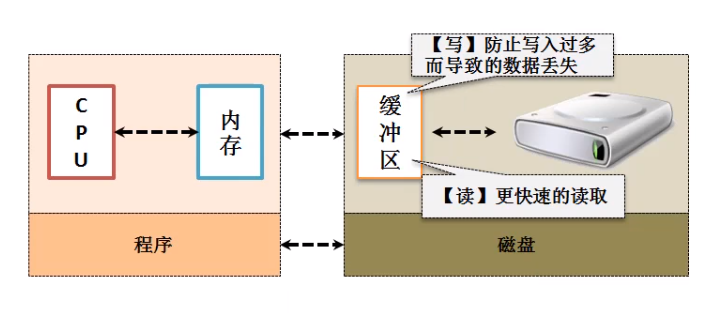
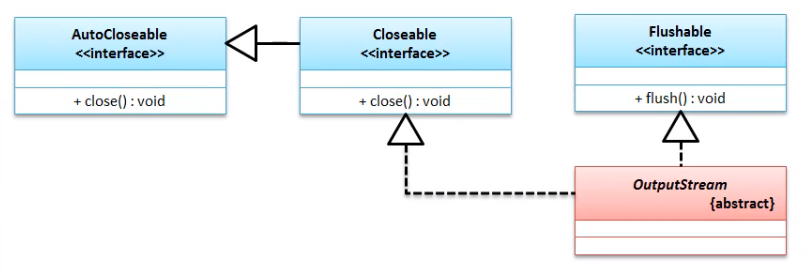
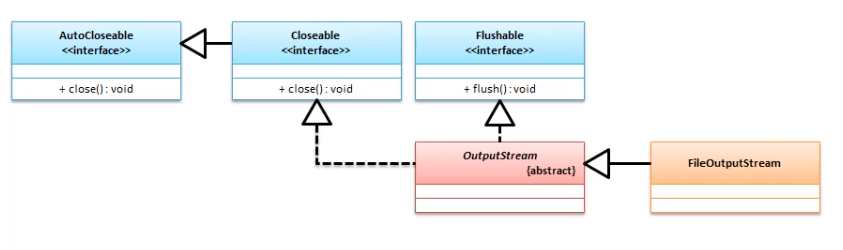
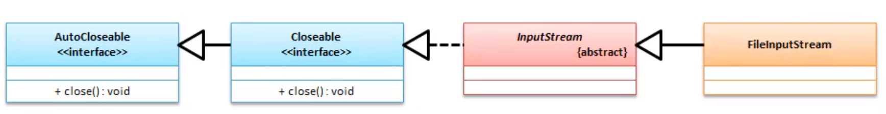
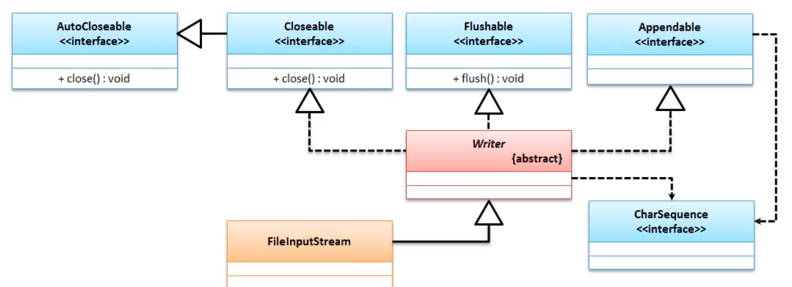
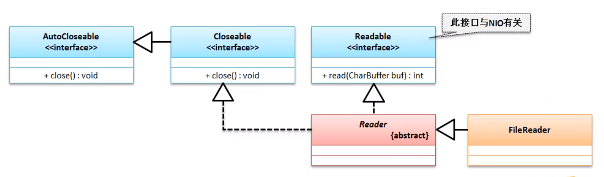
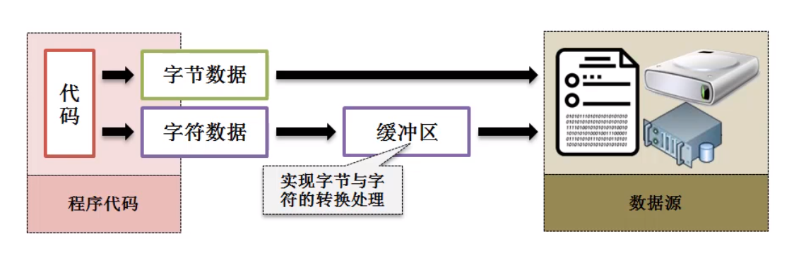

# IO流

> File只提供了文件的处理 , 但没有提供内容的修改 , 修改内容就需要使用流 , 所有的流都分为==输入流==和==输出流==

- 字节操作流：OutputStream（字节输出流）、InputStream（字节输入流）；
- 字符操作流：Writer（字符输出流）、Reader（字符输入流）；




## 操作规则

以文件流为例

1. 通过File类设定要操作的文件路径（针对于文件流而言）；
2. 通过字节流或字符流的子类为父类进行实例化处理；
3. 进行读、写的流操作；
4. 流属于宝贵资源，操作完成后必须关闭（`.close()`）


## 1.字节输出流 OutputStream

```java
public abstract class OutputStream
extends Object
implements Closeable, Flushable
```



|  方法                                | 描述                                                         |
| :----------------------- | :----------------------------------------------------------- |
| `void write(byte[] b)`                   | 输出字节数据     |
| `void write(byte[] b, int off, int len) | ==输出部分字节数据==       |
| `abstract void write(int b)`                      | 将指定的字节写入此输出流。                                   |

### * FileOutputStream

 由于OutputStream 是一个抽象类 , 于是需要一个实现他的子类 , 下面操作文件就使用 `FileOutputStream`来实现

| 构造函数                                      | 描述                                            |
| :-------------------------------------------- | :---------------------------------------------- |
| `FileOutputStream(File file)`                 | 创建文件输出流，每次都对文件内容进行覆盖。      |
| `FileOutputStream(File file, boolean append)` | 创建文件输出流，如果append=true，则对内容为追加 |

范例 : 实现磁盘数据输出

```java
// 1. 定义一个进行磁盘输出的完整路径
File file = new File("c:" + File.separator + "test" + File.separator + "demo.txt");
File parentFile = file.getParentFile();
if (!parentFile.exists()) {
    parentFile.mkdir(); // 创建父路径
}
file.createNewFile();
// 2. OutputStream是抽象类 , 他需要一个子类的实例化
//OutputStream outputStream = new FileOutputStream(file);
OutputStream fileOutputStream = new FileOutputStream(file, true);// true为追加内容
// 3. 数据的输出,数据的输出需要将内容变为字节数组
// outputStream.write("你好outputStream".getBytes());

fileOutputStream.write("我是追加内容".getBytes());
// 4. 关闭流
//outputStream.close();
fileOutputStream.close();
```


## 2.字节输入流 InputStream

```java
public abstract class InputStream
extends Object
implements Closeable
```

> 输入流不需要清空缓存

| 修饰符和类型 方法                      | 描述                                                         |
| :------------------------------------- | :----------------------------------------------------------- |
| `abstract int read()`                  | 读取单个字节数据，如果没有数据了返回“-1”。                   |
| `int read(byte[] b)`                   | 将内容读取到字节数组中，返回读取个数。如果没有数据返回“-1”； |
| `int read(byte[] b, int off, int len)` | 将内容读取部分到字节数组中，返回读取个数。如果没有数据返回“-1”； |
| `byte[] readAllBytes()`                | 从输入流中读取所有字节。（1.9才出现的，如果请求的内容过大，会造成内存溢出） |

### *FileInputStream



```java
FileInputStream​(File file) // 构造方法
```

范例 : 读取数据

```java
File file = new File("c:" + File.separator + "test" + File.separator + "ddd.mp4");
// 1. 获取流
InputStream inputStream = new FileInputStream(file);
// 2. 开辟存储空间
int len = inputStream.available();
// 3. 获取数据和它的长度
if (len>1024*1024*5)return;//如果大小超过5M就不读取了
byte[] data = new byte[len];
inputStream.read(data);
// 4. 截取并转换为字符串
String s = new String(data,0,len);
System.out.println(s);//答应
```

> `public int available() throws IOException` 获取文件大小

## 3.字符输出流 Writer

```java
public abstract class Writer
extends Object
implements Appendable, Closeable, Flushable
```

​	Writer抽象类与之前的OutputStream类相比，多实现了一个接口Appendable，里面有`Appendable append(CharSequence csq)`方法；



> 在使用Writer类操作输出的时候最大的操作特点就是==在于其可以直接进行字符串的数据处理==；
>
> `public void write(String str)` 
>
> jdk1.4之后添加了 `Appendable` 的实现类有`CharBuffer`, `Segment`, `String`, `StringBuffer`, `StringBuilder`,所以`public Writer append(CharSequence csq) throws IOException`方法可以直接使用其实现类

#### * FileWriter

范例 : FileWriter输出

```java
File file = new File("c:" + File.separator + "test" + File.separator + "demo.txt");
Writer writer = new FileWriter(file);
writer.append("你好");
writer.append("我是");
writer.append("luke");
writer.flush();
writer.close();
```

## 4.字符输入流 Reader

```java
public abstract class Reader
extends Object
implements Readable, Closeable
```

​	在Reader抽象类里面并没有提供像InputStream类那样读取全部内容的方法。



### * FileReader

范例 ： FileReader读取数据

```java
File file = new File("c:" + File.separator + "test" + File.separator + "demo.txt");
Reader reader = new FileReader(file);
char[] data = new char[1024];
int len = reader.read(data);
String s = new String(data, 0, len);
System.out.println(s);
reader.close();
```

> ==因为jdk1.7之后`InputStream``OutputStream``Reader``Writer`都实现了`AutoCloseable` ，而`AutoCloseable`类就可以做到，以上四个操作在`try...`中，就会做到自动关闭；==

# 字符流和字节流的区别

- 字节（网络操作，图片，声音…）
- 字符（中文）



> ==如果要观察缓冲区的存在，就在结束的时候不使用 close 或 flush 就会发现 字节流输出可以正常输出，而字节流是不可以正常输出，因为字符流的数据还在缓冲区，要通过flush 或 close 才可以刷新缓冲区。==

# 转换流