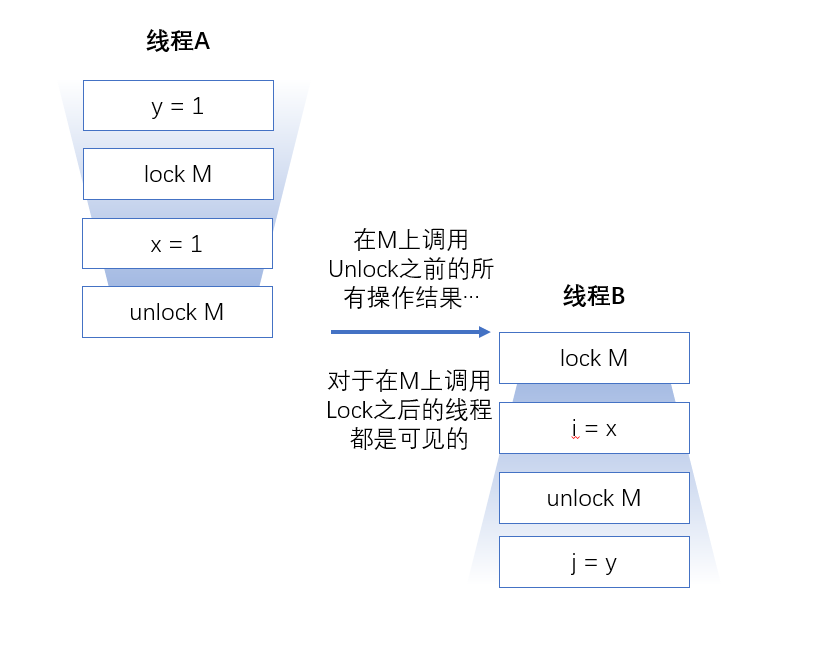

# 对象的共享

​	要编写正确的并发程序，关键问题在于：==在访问共享的可变状态时需要进行正确的管理==

​	我们不仅希望防止某个线程正在使用的对象状态而另一个线程正在修改该状态，而且希望确保一个线程修改了对象状态后，其他线程能够看到发生的变化。如果没有同步，那么这种情况就无法实现。

# 1. 可见性

​	可见性是一个负责的属性，因为可见性的错误总是违背我们的直觉。

​	==在没有同步的情况下，编译器、处理器以及运行时等都可能对操作的执行顺序进行意想不到的调整。在缺乏足够的同步的多线程程序中，要相对内存操作的执行顺序进行判断，几乎无法得到正确的结论。==

​	<u>只要有数据在多个线程之间共享，就可以使用正确的同步</u>

### 1.1 失效数据

​	失效数据可能会导致一些严重的的安全问题或者活跃性问题。

例如 ：

```java
@NotThreadSafe
public class MutableInteger{
    private int value;
    public int get(){return value;}
    public void set(int value){this.value=value;}
}
```

> 如上程序：如果一个线程调用了set方法，另一个线程调用get方法可能会看到更新后的值，也有可能看不到；

然而对get和set方法进行同步锁也会看见失效值；

### 1.2 非原子的64位操作

​	最低安全性适用于大部分变量，但是存在一个例外：非`volatile`类型的64位数值变量（double和long）。

​	Java内存模型要求，变量读取操作和写入操作都必须是原子操作，到时对于非`volatile`类型的long和double变量，JVM允许将64位的读操作或者写操作分解为两个32位操作，读写操作在不同的线程中，很有可能读取到的是某个值的高32位和另一个值得低32位。

​	==即使不考虑失效数据问题，在多线程程序中使用共享且可变的long和double等类型的变量也是不安全的，除非使用`volatile`关键字来声明，或者使用所保护起来。==

### 1.3 加锁与可见性



​	当线程A执行某个同步代码块时，线程B随后进入由同一个所保护的同步代码块，这种情况下可以保证，在所被释放之前，A看到的变量在B获取锁后同样可以由线程B看到，换句话说，当线程B执行有锁保护的同步代码块是，可以看到线程A之前在同一个同步代码块中所有操作结果。如果没有同步，那么就无法实现上述保证。

​	==加锁的含义不仅仅是局限于互斥行为，还包含内存可见性。为了确保所有的线程都能<u>看到最新值</u>，所有执行读操作或者写操作的线程都必须在<u>同一个锁上同步</u>==

### 1.4 Volatile 变量

​	`volatile`相比`synchronized`来说更加轻量级的同步机制。

​	当线程A首先写入一个`volatile`变量并且线程B随后读取该`volatile`变量时，在写入`volatile`变量之前对A可见的所有变量值，在B读取了`volatile`变量后，对B也是可见的。

​	`volatile`==从内存角度来看，写入`volatile`变量相当于退出同步代码块，读取`volatile`变量就相当于进入同步代码块==

> 访问的时候没有同步锁，写入的时候有同步锁；也就说修改默认加锁，读取不加锁；
>
> 然而`volatile`变量只能保证普通的读写安全 ，如果是`count++`则不能保证其安全性，

> ==`volatile`只能保证其可见性，而不能保证其原则性，所以慎用==

​	当满足以下条件可以使用`volatile`：

1. 对变量的写入操作不宜懒变量的当前值；
2. 该变量不会与其他状态变量一起纳入不变性条件中；
3. 在访问变量时不需要加锁；

