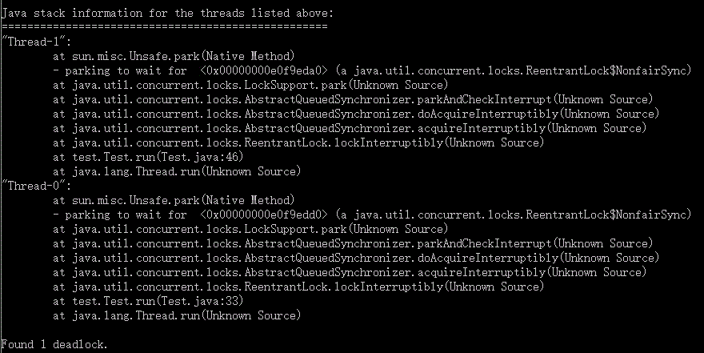
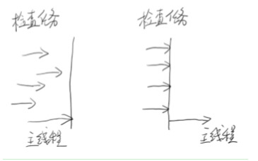
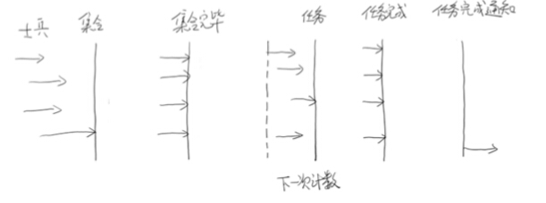
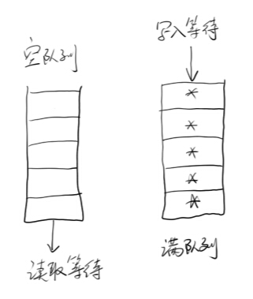

## 1. 各种同步控制工具的使用


ReentrantLock感觉上是synchronized的增强版，synchronized的特点是使用简单，一切交给JVM去处理，但是功能上是比较薄弱的。在JDK1.5之前，ReentrantLock的性能要好于synchronized，由于对JVM进行了优化，现在的JDK版本中，两者性能是不相上下的。如果是简单的实现，不要刻意去使用ReentrantLock。

相比于synchronized，ReentrantLock在功能上更加丰富，它具有可重入、可中断、可限时、公平锁等特点。

首先我们通过一个例子来说明ReentrantLock最初步的用法：

```
package test;

import java.util.concurrent.locks.ReentrantLock;

public class Test implements Runnable
{
	public static ReentrantLock lock = new ReentrantLock();
	public static int i = 0;

	@Override
	public void run()
	{
		for (int j = 0; j < 10000000; j++)
		{
			lock.lock();
			try
			{
				i++;
			}
			finally
			{
				lock.unlock();
			}
		}
	}
	
	public static void main(String[] args) throws InterruptedException
	{
		Test test = new Test();
		Thread t1 = new Thread(test);
		Thread t2 = new Thread(test);
		t1.start();
		t2.start();
		t1.join();
		t2.join();
		System.out.println(i);
	}

}
```

有两个线程都对i进行++操作，为了保证线程安全，使用了 ReentrantLock，从用法上可以看出，与 synchronized相比，ReentrantLock就稍微复杂一点。因为必须在finally中进行解锁操作，如果不在 finally解锁，有可能代码出现异常锁没被释放，而synchronized是由JVM来释放锁。

那么ReentrantLock到底有哪些优秀的特点呢？


单线程可以重复进入，但要重复退出

```
lock.lock();
lock.lock();
try
{
	i++;
			
}			
finally
{
	lock.unlock();
	lock.unlock();
}
```

由于ReentrantLock是重入锁，所以可以反复得到相同的一把锁，它有一个与锁相关的获取计数器，如果拥有锁的某个线程再次得到锁，那么获取计数器就加1，然后锁需要被释放两次才能获得真正释放(重入锁)。这模仿了 synchronized 的语义；如果线程进入由线程已经拥有的监控器保护的 synchronized 块，就允许线程继续进行，当线程退出第二个（或者后续） synchronized 块的时候，不释放锁，只有线程退出它进入的监控器保护的第一个synchronized 块时，才释放锁。

```
public class Child extends Father implements Runnable{
    final static Child child = new Child();//为了保证锁唯一
    public static void main(String[] args) {
        for (int i = 0; i < 50; i++) {
            new Thread(child).start();
        }
    }
 
    public synchronized void doSomething() {
        System.out.println("1child.doSomething()");
        doAnotherThing(); // 调用自己类中其他的synchronized方法
    }
 
    private synchronized void doAnotherThing() {
        super.doSomething(); // 调用父类的synchronized方法
        System.out.println("3child.doAnotherThing()");
    }
 
    @Override
    public void run() {
        child.doSomething();
    }
}
class Father {
    public synchronized void doSomething() {
        System.out.println("2father.doSomething()");
    }
}
```

我们可以看到一个线程进入不同的 synchronized方法，是不会释放之前得到的锁的。所以输出还是顺序输出。所以synchronized也是重入锁

输出：

```
1child.doSomething()
2father.doSomething()
3child.doAnotherThing()
1child.doSomething()
2father.doSomething()
3child.doAnotherThing()
1child.doSomething()
2father.doSomething()
3child.doAnotherThing()
...
```


与synchronized不同的是，ReentrantLock对中断是有响应的。中断相关知识查看[[高并发Java 二\] 多线程基础](http://my.oschina.net/hosee/blog/599000#OSC_h3_6)

普通的lock.lock()是不能响应中断的，lock.lockInterruptibly()能够响应中断。

我们模拟出一个死锁现场，然后用中断来处理死锁

```
package test;

import java.lang.management.ManagementFactory;
import java.lang.management.ThreadInfo;
import java.lang.management.ThreadMXBean;
import java.util.concurrent.locks.ReentrantLock;

public class Test implements Runnable
{
	public static ReentrantLock lock1 = new ReentrantLock();
	public static ReentrantLock lock2 = new ReentrantLock();

	int lock;

	public Test(int lock)
	{
		this.lock = lock;
	}

	@Override
	public void run()
	{
		try
		{
			if (lock == 1)
			{
				lock1.lockInterruptibly();
				try
				{
					Thread.sleep(500);
				}
				catch (Exception e)
				{
					// TODO: handle exception
				}
				lock2.lockInterruptibly();
			}
			else
			{
				lock2.lockInterruptibly();
				try
				{
					Thread.sleep(500);
				}
				catch (Exception e)
				{
					// TODO: handle exception
				}
				lock1.lockInterruptibly();
			}
		}
		catch (Exception e)
		{
			// TODO: handle exception
		}
		finally
		{
			if (lock1.isHeldByCurrentThread())
			{
				lock1.unlock();
			}
			if (lock2.isHeldByCurrentThread())
			{
				lock2.unlock();
			}
			System.out.println(Thread.currentThread().getId() + ":线程退出");
		}
	}

	public static void main(String[] args) throws InterruptedException
	{
		Test t1 = new Test(1);
		Test t2 = new Test(2);
		Thread thread1 = new Thread(t1);
		Thread thread2 = new Thread(t2);
		thread1.start();
		thread2.start();
		Thread.sleep(1000);
		//DeadlockChecker.check();
	}

	static class DeadlockChecker
	{
		private final static ThreadMXBean mbean = ManagementFactory
				.getThreadMXBean();
		final static Runnable deadlockChecker = new Runnable()
		{
			@Override
			public void run()
			{
				// TODO Auto-generated method stub
				while (true)
				{
					long[] deadlockedThreadIds = mbean.findDeadlockedThreads();
					if (deadlockedThreadIds != null)
					{
						ThreadInfo[] threadInfos = mbean.getThreadInfo(deadlockedThreadIds);
						for (Thread t : Thread.getAllStackTraces().keySet())
						{
							for (int i = 0; i < threadInfos.length; i++)
							{
								if(t.getId() == threadInfos[i].getThreadId())
								{
									t.interrupt();
								}
							}
						}
					}
					try
					{
						Thread.sleep(5000);
					}
					catch (Exception e)
					{
						// TODO: handle exception
					}
				}

			}
		};
		
		public static void check()
		{
			Thread t = new Thread(deadlockChecker);
			t.setDaemon(true);
			t.start();
		}
	}

}
```

上述代码有可能会发生死锁，线程1得到lock1，线程2得到lock2，然后彼此又想获得对方的锁。

我们用jstack查看运行上述代码后的情况



的确发现了一个死锁。

DeadlockChecker.check();方法用来检测死锁，然后把死锁的线程中断。中断后，线程正常退出。


超时不能获得锁，就返回false，不会永久等待构成死锁

使用lock.tryLock(long timeout, TimeUnit unit)来实现可限时锁，参数为时间和单位。

举个例子来说明下可限时：

```
package test;

import java.util.concurrent.TimeUnit;
import java.util.concurrent.locks.ReentrantLock;

public class Test implements Runnable
{
	public static ReentrantLock lock = new ReentrantLock();

	@Override
	public void run()
	{
		try
		{
			if (lock.tryLock(5, TimeUnit.SECONDS))
			{
				Thread.sleep(6000);
			}
			else
			{
				System.out.println("get lock failed");
			}
		}
		catch (Exception e)
		{
		}
		finally
		{
			if (lock.isHeldByCurrentThread())
			{
				lock.unlock();
			}
		}
	}
	
	public static void main(String[] args)
	{
		Test t = new Test();
		Thread t1 = new Thread(t);
		Thread t2 = new Thread(t);
		t1.start();
		t2.start();
	}

}
```

使用两个线程来争夺一把锁，当某个线程获得锁后，sleep6秒，每个线程都只尝试5秒去获得锁。

所以必定有一个线程无法获得锁。无法获得后就直接退出了。

输出：

```
get lock failed
```


使用方式：

```
public ReentrantLock(boolean fair) 

public static ReentrantLock fairLock = new ReentrantLock(true);
```

一般意义上的锁是不公平的，不一定先来的线程能先得到锁，后来的线程就后得到锁。不公平的锁可能会产生饥饿现象。

公平锁的意思就是，这个锁能保证线程是先来的先得到锁。虽然公平锁不会产生饥饿现象，但是公平锁的性能会比非公平锁差很多。


Condition与ReentrantLock的关系就类似于synchronized与Object.wait()/signal()

await()方法会使当前线程等待，同时释放当前锁，当其他线程中使用signal()时或者signalAll()方法时，线 程会重新获得锁并继续执行。或者当线程被中断时，也能跳出等待。这和Object.wait()方法很相似。

awaitUninterruptibly()方法与await()方法基本相同，但是它并不会再等待过程中响应中断。 singal()方法用于唤醒一个在等待中的线程。相对的singalAll()方法会唤醒所有在等待中的线程。这和Obejct.notify()方法很类似。

这里就不再详细介绍了。举个例子来说明：

```
package test;

import java.util.concurrent.locks.Condition;
import java.util.concurrent.locks.ReentrantLock;

public class Test implements Runnable
{
	public static ReentrantLock lock = new ReentrantLock();
	public static Condition condition = lock.newCondition();

	@Override
	public void run()
	{
		try
		{
			lock.lock();
			condition.await();
			System.out.println("Thread is going on");
		}
		catch (Exception e)
		{
			e.printStackTrace();
		}
		finally
		{
			lock.unlock();
		}
	}
	
	public static void main(String[] args) throws InterruptedException
	{
		Test t = new Test();
		Thread thread = new Thread(t);
		thread.start();
		Thread.sleep(2000);
		
		lock.lock();
		condition.signal();
		lock.unlock();
	}

}
```

上述例子很简单，让一个线程await住，让主线程去唤醒它。condition.await()/signal只能在得到锁以后使用。


对于锁来说，它是互斥的排他的。意思就是，只要我获得了锁，没人能再获得了。

而对于Semaphore来说，它允许多个线程同时进入临界区。可以认为它是一个共享锁，但是共享的额度是有限制的，额度用完了，其他没有拿到额度的线程还是要阻塞在临界区外。当额度为1时，就相等于lock

下面举个例子：

```
package test;

import java.util.concurrent.ExecutorService;
import java.util.concurrent.Executors;
import java.util.concurrent.Semaphore;


public class Test implements Runnable
{
	final Semaphore semaphore = new Semaphore(5);
	@Override
	public void run()
	{
		try
		{
			semaphore.acquire();
			Thread.sleep(2000);
			System.out.println(Thread.currentThread().getId() + " done");
		}
		catch (Exception e)
		{
			e.printStackTrace();
		}finally {
			semaphore.release();
		}
	}
	
	public static void main(String[] args) throws InterruptedException
	{
		ExecutorService executorService = Executors.newFixedThreadPool(20);
		final Test t = new Test();
		for (int i = 0; i < 20; i++)
		{
			executorService.submit(t);
		}
	}

}
```

有一个20个线程的线程池，每个线程都去 Semaphore的许可，Semaphore的许可只有5个，运行后可以看到，5个一批，一批一批地输出。

当然一个线程也可以一次申请多个许可

```
public void acquire(int permits) throws InterruptedException
```


ReadWriteLock是区分功能的锁。读和写是两种不同的功能，读-读不互斥，读-写互斥，写-写互斥。

这样的设计是并发量提高了，又保证了数据安全。

使用方式：

```
private static ReentrantReadWriteLock readWriteLock=new ReentrantReadWriteLock(); 
private static Lock readLock = readWriteLock.readLock(); 
private static Lock writeLock = readWriteLock.writeLock();
```

详细例子可以查看 [Java实现生产者消费者问题与读者写者问题](http://my.oschina.net/hosee/blog/485121)，这里就不展开了。


倒数计时器
一种典型的场景就是火箭发射。在火箭发射前，为了保证万无一失，往往还要进行各项设备、仪器的检查。 只有等所有检查完毕后，引擎才能点火。这种场景就非常适合使用CountDownLatch。它可以使得点火线程
，等待所有检查线程全部完工后，再执行

使用方式：

```
static final CountDownLatch end = new CountDownLatch(10);
end.countDown(); 
end.await();
```

示意图：



一个简单的例子：

```
package test;

import java.util.concurrent.CountDownLatch;
import java.util.concurrent.ExecutorService;
import java.util.concurrent.Executors;

public class Test implements Runnable
{
	static final CountDownLatch countDownLatch = new CountDownLatch(10);
	static final Test t = new Test();
	@Override
	public void run()
	{
		try
		{
			Thread.sleep(2000);
			System.out.println("complete");
			countDownLatch.countDown();
		}
		catch (Exception e)
		{
			e.printStackTrace();
		}
	}
	
	public static void main(String[] args) throws InterruptedException
	{
		ExecutorService executorService = Executors.newFixedThreadPool(10);
		for (int i = 0; i < 10; i++)
		{
			executorService.execute(t);
		}
		countDownLatch.await();
		System.out.println("end");
		executorService.shutdown();
	}

}
```

主线程必须等待10个线程全部执行完才会输出"end"。


和CountDownLatch相似，也是等待某些线程都做完以后再执行。与CountDownLatch区别在于这个计数器可以反复使用。比如，假设我们将计数器设置为10。那么凑齐第一批1 0个线程后，计数器就会归零，然后接着凑齐下一批10个线程

使用方式：

```
public CyclicBarrier(int parties, Runnable barrierAction) 

barrierAction就是当计数器一次计数完成后，系统会执行的动作

await()
```

示意图：



下面举个例子：

```
package test;

import java.util.concurrent.CyclicBarrier;

public class Test implements Runnable
{
	private String soldier;
	private final CyclicBarrier cyclic;

	public Test(String soldier, CyclicBarrier cyclic)
	{
		this.soldier = soldier;
		this.cyclic = cyclic;
	}

	@Override
	public void run()
	{
		try
		{
			//等待所有士兵到齐
			cyclic.await();
			dowork();
			//等待所有士兵完成工作
			cyclic.await();
		}
		catch (Exception e)
		{
			// TODO Auto-generated catch block
			e.printStackTrace();
		}

	}

	private void dowork()
	{
		// TODO Auto-generated method stub
		try
		{
			Thread.sleep(3000);
		}
		catch (Exception e)
		{
			// TODO: handle exception
		}
		System.out.println(soldier + ": done");
	}

	public static class BarrierRun implements Runnable
	{

		boolean flag;
		int n;

		public BarrierRun(boolean flag, int n)
		{
			super();
			this.flag = flag;
			this.n = n;
		}

		@Override
		public void run()
		{
			if (flag)
			{
				System.out.println(n + "个任务完成");
			}
			else
			{
				System.out.println(n + "个集合完成");
				flag = true;
			}

		}

	}

	public static void main(String[] args)
	{
		final int n = 10;
		Thread[] threads = new Thread[n];
		boolean flag = false;
		CyclicBarrier barrier = new CyclicBarrier(n, new BarrierRun(flag, n));
		System.out.println("集合");
		for (int i = 0; i < n; i++)
		{
			System.out.println(i + "报道");
			threads[i] = new Thread(new Test("士兵" + i, barrier));
			threads[i].start();
		}
	}

}
```

打印结果：

```
集合
0报道
1报道
2报道
3报道
4报道
5报道
6报道
7报道
8报道
9报道
10个集合完成
士兵5: done
士兵7: done
士兵8: done
士兵3: done
士兵4: done
士兵1: done
士兵6: done
士兵2: done
士兵0: done
士兵9: done
10个任务完成
```


提供线程阻塞原语

和suspend类似

```
LockSupport.park(); 
LockSupport.unpark(t1);
```

与suspend相比 不容易引起线程冻结

LockSupport的思想呢，和 Semaphore有点相似，内部有一个许可，park的时候拿掉这个许可，unpark的时候申请这个许可。所以如果unpark在park之前，是不会发生线程冻结的。

下面的代码是[[高并发Java 二\] 多线程基础](http://my.oschina.net/hosee/blog/599000#OSC_h3_7)中suspend示例代码，在使用suspend时会发生死锁。

```
package test;

import java.util.concurrent.locks.LockSupport;
 
public class Test
{
    static Object u = new Object();
    static TestSuspendThread t1 = new TestSuspendThread("t1");
    static TestSuspendThread t2 = new TestSuspendThread("t2");
 
    public static class TestSuspendThread extends Thread
    {
        public TestSuspendThread(String name)
        {
            setName(name);
        }
 
        @Override
        public void run()
        {
            synchronized (u)
            {
                System.out.println("in " + getName());
                //Thread.currentThread().suspend();
                LockSupport.park();
            }
        }
    }
 
    public static void main(String[] args) throws InterruptedException
    {
        t1.start();
        Thread.sleep(100);
        t2.start();
//        t1.resume();
//        t2.resume();
        LockSupport.unpark(t1);
        LockSupport.unpark(t2);
        t1.join();
        t2.join();
    }
}
```

而使用 LockSupport则不会发生死锁。

另外

park()能够响应中断，但不抛出异常。中断响应的结果是，park()函数的返回，可以从Thread.interrupted()得到中断标志。

在JDK当中有大量地方使用到了park，当然LockSupport的实现也是使用unsafe.park()来实现的。

```
public static void park() {
        unsafe.park(false, 0L);
    }
```


下面来介绍下ReentrantLock的实现，ReentrantLock的实现主要由3部分组成：

* CAS状态
* 等待队列
* park()

ReentrantLock的父类中会有一个state变量来表示同步的状态

```
/**
     * The synchronization state.
     */
    private volatile int state;
```

通过CAS操作来设置state来获取锁，如果设置成了1，则将锁的持有者给当前线程

```
final void lock() {
            if (compareAndSetState(0, 1))
                setExclusiveOwnerThread(Thread.currentThread());
            else
                acquire(1);
        }
```

如果拿锁不成功，则会做一个申请

```
public final void acquire(int arg) {
        if (!tryAcquire(arg) &&
            acquireQueued(addWaiter(Node.EXCLUSIVE), arg))
            selfInterrupt();
    }
```

首先，再去申请下试试看tryAcquire，因为此时可能另一个线程已经释放了锁。

如果还是没有申请到锁，就addWaiter，意思是把自己加到等待队列中去

```
private Node addWaiter(Node mode) {
        Node node = new Node(Thread.currentThread(), mode);
        // Try the fast path of enq; backup to full enq on failure
        Node pred = tail;
        if (pred != null) {
            node.prev = pred;
            if (compareAndSetTail(pred, node)) {
                pred.next = node;
                return node;
            }
        }
        enq(node);
        return node;
    }
```

其间还会有多次尝试去申请锁，如果还是申请不到，就会被挂起

```
private final boolean parkAndCheckInterrupt() {
        LockSupport.park(this);
        return Thread.interrupted();
    }
```

同理，如果在unlock操作中，就是释放了锁，然后unpark，这里就不具体讲了。


### 2.1 ConcurrentHashMap 

我们知道HashMap不是一个线程安全的容器，最简单的方式使HashMap变成线程安全就是使用Collections.synchronizedMap，它是对HashMap的一个包装

```
public static Map m=Collections.synchronizedMap(new HashMap());
```

同理对于List，Set也提供了相似方法。

但是这种方式只适合于并发量比较小的情况。

我们来看下synchronizedMap的实现

```
private final Map<K,V> m;     // Backing Map
        final Object      mutex;        // Object on which to synchronize

        SynchronizedMap(Map<K,V> m) {
            if (m==null)
                throw new NullPointerException();
            this.m = m;
            mutex = this;
        }

        SynchronizedMap(Map<K,V> m, Object mutex) {
            this.m = m;
            this.mutex = mutex;
        }

        public int size() {
            synchronized (mutex) {return m.size();}
        }
        public boolean isEmpty() {
            synchronized (mutex) {return m.isEmpty();}
        }
        public boolean containsKey(Object key) {
            synchronized (mutex) {return m.containsKey(key);}
        }
        public boolean containsValue(Object value) {
            synchronized (mutex) {return m.containsValue(value);}
        }
        public V get(Object key) {
            synchronized (mutex) {return m.get(key);}
        }

        public V put(K key, V value) {
            synchronized (mutex) {return m.put(key, value);}
        }
        public V remove(Object key) {
            synchronized (mutex) {return m.remove(key);}
        }
        public void putAll(Map<? extends K, ? extends V> map) {
            synchronized (mutex) {m.putAll(map);}
        }
        public void clear() {
            synchronized (mutex) {m.clear();}
        }
```

它会将HashMap包装在里面，然后将HashMap的每个操作都加上synchronized。

由于每个方法都是获取同一把锁(mutex)，这就意味着，put和remove等操作是互斥的，大大减少了并发量。

下面来看下ConcurrentHashMap是如何实现的

```
public V put(K key, V value) {
        Segment<K,V> s;
        if (value == null)
            throw new NullPointerException();
        int hash = hash(key);
        int j = (hash >>> segmentShift) & segmentMask;
        if ((s = (Segment<K,V>)UNSAFE.getObject          // nonvolatile; recheck
             (segments, (j << SSHIFT) + SBASE)) == null) //  in ensureSegment
            s = ensureSegment(j);
        return s.put(key, hash, value, false);
    }
```

在 ConcurrentHashMap内部有一个Segment段，它将大的HashMap切分成若干个段（小的HashMap），然后让数据在每一段上Hash，这样多个线程在不同段上的Hash操作一定是线程安全的，所以只需要同步同一个段上的线程就可以了，这样实现了锁的分离，大大增加了并发量。

在使用ConcurrentHashMap.size时会比较麻烦，因为它要统计每个段的数据和，在这个时候，要把每一个段都加上锁，然后再做数据统计。这个就是把锁分离后的小小弊端，但是size方法应该是不会被高频率调用的方法。

在实现上，不使用synchronized和lock.lock而是尽量使用trylock，同时在HashMap的实现上，也做了一点优化。这里就不提了。


BlockingQueue不是一个高性能的容器。但是它是一个非常好的共享数据的容器。是典型的生产者和消费者的实现。

示意图：

