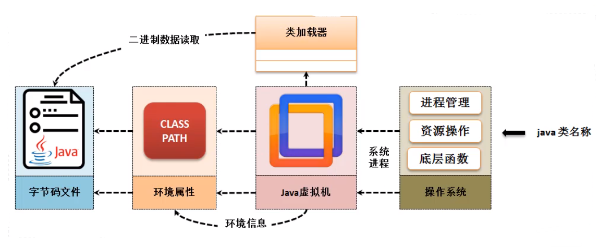

# 类加载器 ClassLoader

## Java程序的执行

操作系统操作Java虚拟机 -> java虚拟机获取环境属性(classpath) -> 通过环境信息classpath让 类加载器ClassLoader寻找 *.class字节码文件 -> 获取成功进行操作



## ClassLoader 简介

所有`*.class`文件都会在磁盘上以二进制数据进行保存 (反射机制提供的就是二进制文件的解析能力) , 但是如果想要进行解析 , 就要做到类的信息加载 , 于是在JDK中提供了一个ClassLoader加载器 , 如果要想观察ClassLoader可以直接利用Class类的方法来完成 :

| Class 类有一个方法                   |
| ------------------------------------ |
| public ClassLoader getClassLoader(); |

获取ClassLoader就可以继续获取它之上的个各类的加载器 , 也可以依据此 ClassLoader找到对应的二进制字节码对应的信息 , 这个类重要的方法是获取父加载器 : `public final ClassLoader getParent() `

### 范例：观察加载器的不同（通过系统类“Strign”完成）

```java
System.out.println(Ball.class.getClassLoader());
System.out.println(Ball.class.getClassLoader().getParent());
System.out.println(Ball.class.getClassLoader().getParent().getParent();
```

运行结果 : 

```cmd
jdk.internal.loader.ClassLoaders$AppClassLoader@4629104a
jdk.internal.loader.ClassLoaders$PlatformClassLoader@f5f2bb7
null
```

