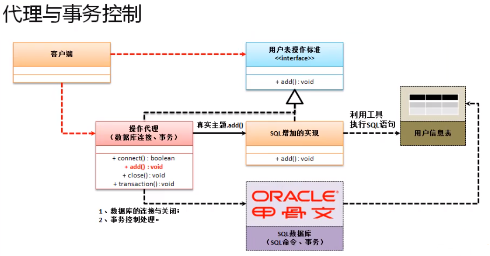
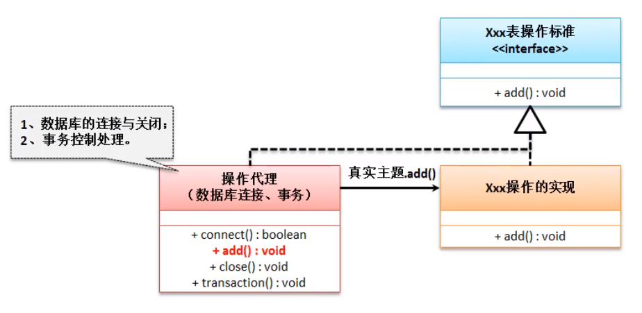
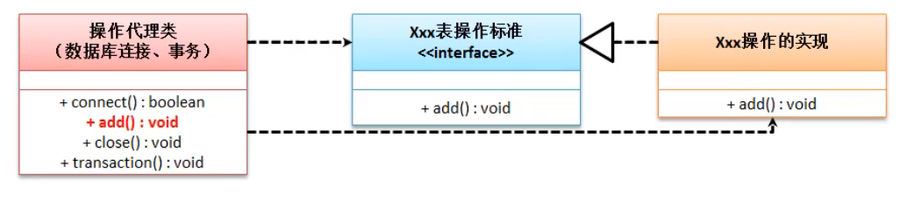
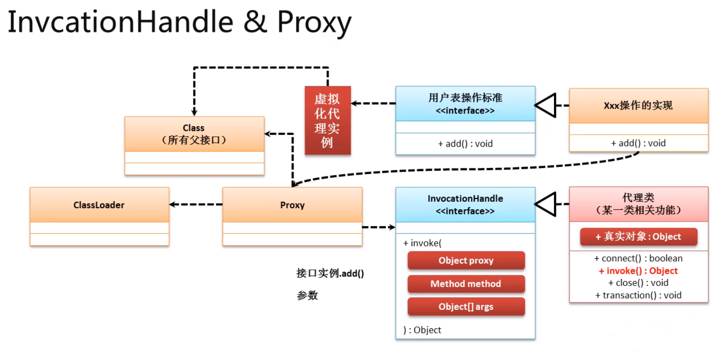

# 代理设计模式
 代理设计模式的最为核心的意义在于 , 所有的操作业务接口丢设置两个子类 , 一个子类负责真是业务处理 , 一个子类负责代理业务处理 , 如果没有这个代理业务 , 真是业务也无法进行处理 . 

 ## 静态代理设计模式的缺陷

现在假设说希望可以实现一个数据处理操作 , 在进行数据处理的时候 , 要求进行合理的事务控制 ,  在数据库操作的时候永远都有一个事务的概念 , 利用事务可以保证数据的完整性 .

代理与事务控制



范例 : 传统的代理实现



如图 : 静态代理每种数据操作都需要去实现一个代理来控制 , 如果有大量的操作 , 就会写大量的代理 , 这种设计方式只能瞒住一个操作接口的操作 . 

## 动态代理设计模式

如果要要解决静态代理模式的代码重复操作问题 , 就只能利用动态代理设计模式来解决 . 

 动态代理设计模式 : 指的是一组相关的操作接口的实现 , 我们可以设置统一的代理类 . 



动态代理类是在 JDK1.3的时候添加到项目中的 , 如果要实现动态代理类需要`Invocation`接口和`Proxy`类的支持 

### java.lang.reflect.InvocationHandle接口的定义 :

```java
public Object invoke(Object proxy, Method method, Object[] args) throws Throwable;
```

对于一个代理设计需要解决的核心问题在于 , 如何可以让 InvocationHandle 的子类 和 业务接口有关联 . 

此时就需要通过 `java.lang.reflect.Proxy`类来进行创建关联 . 

```java
public static Object newProxyInstance(ClassLoader loader, Class<?>[] interfaces, InvocationHandler h)
```

这种代理对象的创建是依据真实主题类的对象的加载器 , 和其实现的父接口动态创建的一个新的子类 , 该子类由JVM在运行的时候由JVM自行负责创建 . 



范例 : 

```java
代码需要再看一遍
```

结果 :

```cmd
没代码哪里来的结果
```

此时的代码利用动态代理设计类动态的构建了接口的实现子类实例 , 并且利用 InvocationHandler.invoke() 实现标准的代码执行调用 , 在里面进行代理控制 .