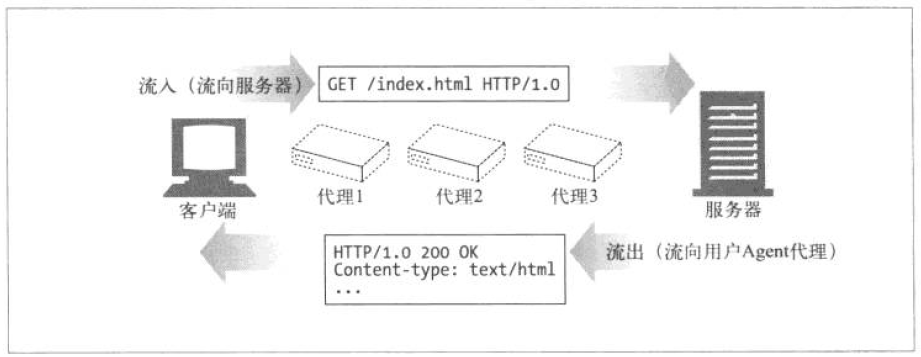
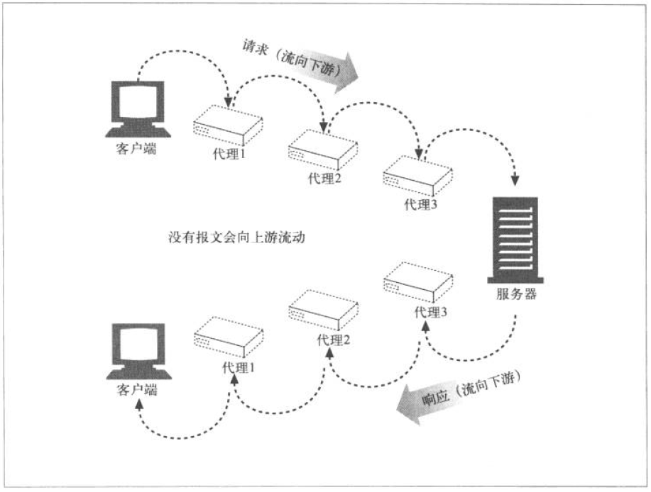
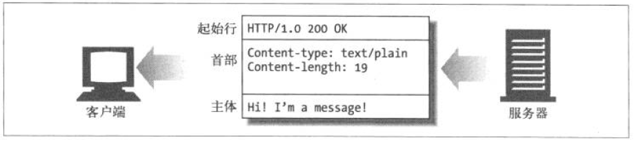
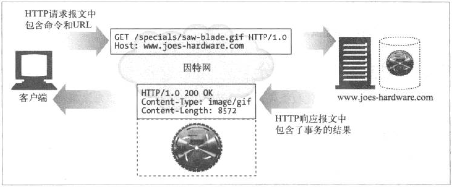
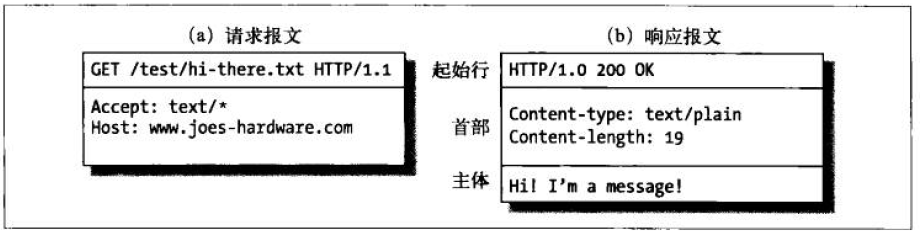

# 1.报文流

`HTTP`报文是在`HTTP`应用之间发送的数据块. 这些数据块以一些文本的形式`元信息`开头, 这些信息描述了报文的内容以及含义, 后面跟着可选的数据部分. 这些报文在`客户端` \ `服务器` \ `代理`之间流动. 

术语`流入` \ `流出` \ `上游` \ `下游` ,都是来描述报文的流向的.

## 1.1报文流入远端服务器

HTTP使用术语`流入`和`流出`来描述事务处理的方向.

报文流入源端服务器, 工作完成之后, 回流会用户的`Agent`代理中



## 1.2报文向下流动

HTTP报文会像河水一样流动. 不管是请求报文还是响应报文, 所有的报文都会向`下游`流动, 所有的报文的发送者都在接收者的`上游`. 对请求报文来说, `代理1`位于`代理3`的`上游`, 但对响应报文来说, 它就位于`代理3`的`下游`.



# 2.报文的组成

HTTP报文是简单格式化数据块, 每条报文都包含一个来自客户端的请求, 或者来自服务器的响应. 他们由三个部分组成: 

1. 对报文进行描述的`起始行(start line)`
2. 包含属性的`首部(header`
3. 可选的数据`主体(body)`



* 起始行和首部是由行分隔符的`ASCII`文本.

* 每行都以一个有两个字符组成的终止序列作为结束,其中包括一个`回车符(ASCII码13)`和一个`换行符(ASCII码10)`
* 这个行终止序列可以写作`CRLF`.
* 需要指出的是,尽管HTTP规范中说明应该用`CRLF`来表示行终止,但文件的应用程序也应该接受带个换行符作为行终止
* 有的老的,或者不完整的HTTP应用程序并不总是及发送回车符,又发送换行符
* 实体的主体或报文的主体是一个可选的数据块, 与起始行和首部不同的是, 主体可以包含文本或二进制数据, 也可以是空

## 2.1报文的语法

所有HTTP报文都可以分为两类:`请求报文(request message)`和`响应报文(response message)`.

请求报文会向Web服务器请求一个动作. 响应报文会将请求的结果返回给客户端. 



这是请求报文的格式

``` 
<method> <request-URL> <version>
<headers>

<entity-body>
```

这是响应报文

```
<version> <status> <reason-phrase>
<headers>

<entity-body>
```

下面是对各部分的简要概述

* 方法(method)

  客户端希望服务器对资源执行的动作, 是一个单独的词, 比如`get` `head` 或 `post`

* 请求URL(request-URL)

  命名了所有请求资源, 或者URL路径组件的完整URL. 如果直接与服务器进行对话, 只要URL的路径组件是资源的绝对路径, 通常就不会有什么问题--服务器可以假定自己是一个URL的主机/端口

* 版本(version)

  报文所使用的HTTP版本,其格式为:

  ```
  HTTP/<major>.<minor>
  ```

  `magor` 是主要版本

  `minor` 是次要版本

* 状态码(status-code)

  这三位数描述了请求过程中所发生的情况, 每个状态码的第一位数字都用于描述状态的一半类别("成功" / "出错"等)

* 原因短语(reason-phrase)

  数字状态妈的可读版本,包含行终止序列之前所有的文本, 元婴短语只对人类有意义

* 首部(headers)

  * 可以有零个或者多个首部,每个首部都包含一个名字,后面跟着一个冒号(`:`)然后是一个可选的空格,接着是一个值,最后一个是`CRLF`
  * 首部是由一个`CRLF`结束的, 表示首部和实体主体的开始
  * 有些HTTP版本,比如`HTTP/1.1`要求有效的请求或相应报文中必须包含特定的首部

* 实体的主体部分(entity-body)

  实体的主体部分包含一个任意数据组成的数据块.



> 注意:一组HTTP首部总是应该以一个空行(单个CRLF)结束,甚至即使没有首部和实体的主体部分也应该如此. 但由于历史原因, 很多客户端都没在实体的主图部分是,省略了CRLF. 为了与这些流行但不符合规则的实现互通, 客户端和服务器最终都应该接受哪些没有CRLF的报文.

## 2.2起始行

所有的HTTP报文都以一个起始行作为一个开始, 请求报文的起始行说明了要做些什么. 响应报文的起始行说明了发生了什么

### a. 请求行

请求报文请求服务器对资源进行一些操作。请求报文的起始行,或称为请求行,包含了一个方法和一个请求URL,这个方法描述了服务器应该执行的操作,请求URL描述了要对哪个资源执行这个方法。请求行中还包含HTTP的版本,用来告知服务器,客户端使用的是哪种HTTP.

所有这些字段都由空格符分隔。在图3-5a中,请求方法为GET,请求URL为`ltest/hi-there.txt`,版本为`HTTP/1.1`。在`HTTP1.0`之前,并不要求请求行中包含 HTTP版本号。

### b. 响应行

响应报文承载了状态信息和操作产生的所有结果数据,将其返回给客户端。

响应报文的起始行,或称为响应行,包含了响应报文使用的HTTP版本、数字状态码,以及描述操作状态的文本形式的原因短语。

所有这些字段都由空格符进行分隔。

HTTP版本为HTTP/1.0,状态码为200 (表示成功),原因短语为OK,表示文档已经被成功返回了。

在HTTP/1.0之前,并不要求在响应中包含响应行。

### c. 方法

请求的起始行以方法作为开始,方法用来告知服务器要做些什么。比如,在行 `GET /specials/saw-blade.gif HTTP/1.0`中,方法就是GET.

| 方法    | 描述                                             | 是否包含主体 |
| ------- | ------------------------------------------------ | ------------ |
| GET     | 获取文档                                         | 否           |
| HEAD    | 获取文档的首部                                   | 否           |
| POST    | 发送需要处理的数据                               | 是           |
| PUT     | 将请求的主体部分存储在服务器上                   | 是           |
| TRACE   | 对可能经过代理服务器传送到服务器上的报文进行追踪 | 否           |
| OPTIONS | 决定在服务器上执行哪些方法                       | 否           |
| DELETE  | 从服务器上删除一份文档                           | 否           |

由于HTTP设计得易于扩展,所以除了这些方法之外,其他服务器可能还会实现一些自己的请求方法。这些附加的方法是对HTTP规范的扩展,因此被称为扩展方法。

### d. 状态码

方法是用来告诉服务器做什么事情的,状态码则用来告诉客户端,发生了什么事情。

状态码位于响应的起始行中。比如,在行HTTP/1.0 200 OK中,状态码就是200。

| 整体范围 | 已定义范围 | 分类       |
| -------- | ---------- | ---------- |
| 100~199  | 100~101    | 信息提示   |
| 200~299  | 200~206    | 成功       |
| 300~399  | 300~305    | 重定向     |
| 400~499  | 400~415    | 客户端错误 |
| 500~599  | 500~505    | 服务器错误 |


### e. 短语原因

原因短语是响应起始行中的最后一个组件。它为状态码提供了文本形式的解释。比如,在行HTTP/1.0200 OK中, OK就是原因短语。原因短语和状态码是成对出现的。

原因短语是状态码的可读版本,应用程序开发者将其传送给用户,用以说明在请求期间发生了什么情况。

### f. 版本号

版本号会以HTTP/x.y的形式出现在请求和响应报文的起始行中。为HTTP应用程序 ,提供了一种将自己所遵循的协议版本告知对方的方式。

## 2.3首部


## 2.4主体部分

# 3.方法

## 3.1安全方法

## 3.2 GET

## 3.3 HEAD

## 3.4 PUT

## 3.5 POST

## 3.6 TRACE

## 3.7 OPTIONS

## 3.8 DELELE

## 3.9 扩展方法


# 4.状态码

## 4.1 100~199 信息性状态码

## 4.2 200~299 成功状态码

## 4.3 300~399 重定向状态码

## 4.4 400~499 客户端错误状态码

## 4.5 500~599 服务端错误状态码


# 5.首部

## 5.1通用首部

## 5.2请求首部

## 5.3响应首部

## 5.4实体首部

# 6.更多信息


